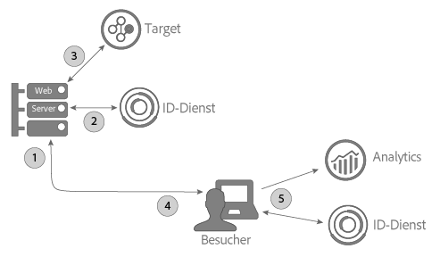

# Verwenden des Besucher-ID-Service mit A4T und einer serverseitigen Implementierung der Target-Komponente {#using-the-id-service-with-a-t-and-a-server-side-implementation-of-target}

Diese Anweisungen richten sich an A4T-Kunden mit gemischten Server- und Client-seitigen Implementierungen von Target, Analytics und dem Besucher-ID-Service. Kunden, die den Besucher-ID-Dienst in einer NodeJS- oder Rhino-Umgebung ausführen müssen, sollten diese Informationen ebenfalls überprüfen. Diese Instanz des Besucher-ID-Service verwendet eine gekürzte Version der `VisitorAPI.js`-Code-Bibliothek, die Sie vom Node Package Manager (NPM) herunterladen und installieren. Lesen Sie diesen Abschnitt zu den Installationsanweisungen und anderen Konfigurationsanforderungen.

## Einführung {#section-ab0521ff5bbd44c592c3eaab31c1de8b}

A4T (und andere -Kunden) können diese Version des Besucher-ID-Service für folgende Aufgaben verwenden:

* Webseiteninhalten auf ihren Servern wiedergeben und an einen Browser zur endgültigen Anzeige übermitteln.
* Durchführen von Server-seitigen Target-Aufrufen.
* Client-seitige (In-Browser-)Aufrufe an Analytics ausführen.
* Synchronisieren Sie separate Target- und Analytics-IDs, um festzustellen, ob es sich bei einem Besucher, der von einer Lösung gesehen wird, um dieselbe Person handelt wie bei der anderen Lösung.

## Codedownload und bereitgestellte Schnittstellen {#section-32d75561438b4c3dba8861be6557be8a}

Unter [Besucher-ID-Dienst-NPM-Repository](https://www.npmjs.com/package/@adobe-mcid/visitor-js-server) können Sie das serverseitige Code-Paket herunterladen und die im aktuellen Build enthaltenen Schnittstellen überprüfen.

## Workflow {#section-56b01017922046ed96536404239a272b}

In den folgenden Diagrammen und Abschnitten wird beschrieben, was Sie bei jedem Schritt des serverseitigen Implementierungsprozesses konfigurieren müssen.



## Schritt 1: Anforderungsseite {#section-c12e82633bc94e8b8a65747115d0dda8}

Die serverseitige Aktivität beginnt, wenn ein Besucher eine HTTP-Anforderung zum Laden einer Webseite erstellt. Während dieses Schritts empfängt Ihr Server diese Anfrage und sucht nach dem [AMCV-Cookie](../introduction/cookies.md). Das AMCV-Cookie enthält die ECID des Besuchers.

## Schritt 2: Payload des Besucher-ID-Diensts generieren {#section-c86531863db24bd9a5b761c1a2e0d964}

Als Nächstes müssen Sie eine Server-seitige *`payload request`* an den Besucher-ID-Dienst vornehmen. Eine Nutzlastanforderung:

* Übergibt das AMCV-Cookie an den Besucher-ID-Service.
* Fordert Daten an, die für Target und Analytics in den folgenden Schritten erforderlich sind, die nachfolgend beschrieben werden.

>[!NOTE]
>
>Diese Methode fordert eine einzelne Mbox aus Target an. Wenn Sie mehrere mboxes in einem einzigen Aufruf anfordern müssen, siehe [generateBatchPayload](https://www.npmjs.com/package/@adobe-mcid/visitor-js-server#generatebatchpayload).

Ihre Nutzlastanforderung sollte wie das folgende Codebeispiel aussehen. Die Funktion `visitor.setCustomerIDs` ist im Codebeispiel optional. Weitere Informationen finden Sie unter [Kunden-IDs und Authentifizierungszustände.](../reference/authenticated-state.md)

```js
//Import the Visitor ID Service server package 
var Visitor = require("@adobe-mcid/visitor-js-server"); 
 
//Pass in your IMS org ID to instantiate Visitor 
var visitor = new Visitor("Insert ECID here"); 
 
// 
<i>(Optional)</i> Set a custom customer ID 
visitor.setCustomerIDs({ 
     userid:{ 
          id:"1234", 
          authState: Visitor.AuthState.UNKNOWN //AuthState is a static property of the Visitor class 
     } 
}); 
 
//Parse the visitor's HTTP request for the AMCV cookie 
var cookies = cookie.parse(req.headers.cookie || ""); 
var cookieName = visitor.getCookieName(); // Visitor API that returns the cookie name. 
var amcvCookie = cookies[cookieName]; 
 
//Generate the payload request pass your mbox name and the AMCV cookie if present 
var visitorPayload = visitor.generatePayload({ 
     mboxName: "bottom-banner-mbox", 
     amcvCookie: amcvCookie 
});
```

Der Besucher-ID-Dienst gibt die Payload in einem JSON-Objekt zurück, das dem folgenden Beispiel ähnelt. Payload-Daten sind für Target erforderlich.

```js
{ 
    "marketingCloudVisitorId": "02111696918527575543455026275721941645", 
    "mboxParameters": { 
        "mboxAAMB": "abcd1234", 
        "mboxMCGLH": "9", 
        "mboxMCSDID": "56BE026543F7E211-1CC51BCAAE88F0D2", 
        "vst.userid.id": "1234567890", 
        "vst.userid.authState": 0 
    } 
}
```

Wenn Ihr Besucher über kein AMCV-Cookie verfügt, lässt die Nutzlast die folgenden Schlüssel-Wert-Paare aus:

* `marketingCloudvisitorId`
* `mboxAAMB`
* `mboxMCGLH`

## Schritt 3: Dem Target-Aufruf Nutzlast hinzufügen {#section-62451aa70d2f44ceb9fd0dc2d4f780f7}

Nachdem Ihr Server Payload-Daten vom Besucher-ID-Service erhalten hat, müssen Sie zusätzlichen Code instanziieren, um ihn mit den an Target übergebenen Daten zusammenzuführen. Das endgültige JSON-Objekt, das an Target übergeben wird, würde in etwa wie folgt aussehen:

```js
{ 
"mbox" : "target-global-mbox", 
"marketingCloudVisitorId":"02111696918527575543455026275721941645", 
"requestLocation" : { 
     "pageURL" : "http://www.domain.com/test/demo.html", 
     "host" : "localhost:3000" 
     }, 
"mboxParameters" : { 
     "mboxAAMB" : "abcd1234", 
     "mboxMCGLH" : "9", 
     "mboxMCSDID": "56BE026543F7E211-1CC51BCAAE88F0D2", 
     "vst.userid.id": "1234567890", 
     "vst.userid.authState": 0, 
     } 
} 
```

## Schritt 4: Serverstatus für den Besucher-ID-Dienst abrufen {#section-8ebfd177d42941c1893bfdde6e514280}

Server-Statusdaten enthalten Informationen über die auf dem Server geleistete Arbeit. Der Client-seitige Besucher-ID-Dienst-Code erfordert diese Informationen. Wenn Sie den Besucher-ID-Dienst über einen nicht standardmäßigen Prozess eingerichtet haben, müssen Sie den Serverstatus mit Ihrem eigenen Code zurückgeben. Der Client-seitige Besucher-ID-Service und der Analytics-Code übergeben beim Laden der Seite Statusdaten an Adobe.

Wenn Sie über eine nicht standardmäßige Implementierung des Besucher-ID-Dienstes verfügen, müssen Sie diesen Code so konfigurieren, dass er auf Ihrem Server ausgeführt wird, während er die angeforderte Seite zusammenstellt:

```js
//Get server state 
var serverState = visitor.getState(); 
 
Response.send(" 
... 
<head> 
     <script src="VisitorAPI.js"></script> 
     <script> 
          var visitor = Visitor.getInstance(orgID, { 
          serverState: serverState  
          ... 
     </script> 
</head> 
...
```

## Schritt 5: Eine Seite bereitstellen und CX Enterprise-Daten zurückgeben {#section-4b5631a0d75a41febd6f43f8c214c263}

Zu diesem Zeitpunkt sendet der Webserver Seiteninhalt an den Browser des Besuchers. Ab diesem Zeitpunkt führt der Browser (nicht der Server) alle verbleibenden Aufrufe des Besucher-ID-Service und von Analytics durch. Beispiel im Browser:

* Der Besucher-ID-Dienst empfängt Statusdaten vom Server und übergibt die SDID an AppMeasurement.
* AppMeasurement sendet Daten zum Seitenaufruf an Analytics, einschließlich der SDID.
* Analytics und Target vergleichen SDIDs für diesen Besucher. Bei einer identischen SDID fügen Target und Analytics den Server-seitigen und den Client-seitigen Aufruf zusammen. Zu diesem Zeitpunkt erkennen beide Lösungen diesen Besucher als dieselbe Person.

>[!MORELIKETHIS]
>
>* [Server-seitiges Besucher-ID-Service-Paket von Node Package Manager](https://www.npmjs.com/package/@adobe-mcid/visitor-js-server)

