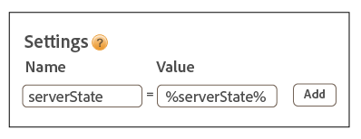

# Verwenden des ID-Diensts mit A4T und einer serverseitigen Implementierung der Target-Komponente {#using-the-id-service-with-a-t-and-a-server-side-implementation-of-target}

Diese Anweisungen richten sich an A4T-Kunden mit kombinierten Server-seitigen und Client-seitigen Implementierungen von Target, Analytics und dem ID-Dienst. Kunden, die den ID-Dienst in einer NodeJS- oder Rhino-Umgebung ausführen müssen, sollten diese Informationen ebenfalls überprüfen. Diese ID-Dienstinstanz verwendet eine gekürzte Version der VisitorAPI.js-Codebibliothek, die Sie über den Node Package Manager (NPM) herunterladen und installieren können. Lesen Sie diesen Abschnitt zu den Installationsanweisungen und anderen Konfigurationsanforderungen.

## Einführung {#section-ab0521ff5bbd44c592c3eaab31c1de8b}

A4T (und andere Kunden) können diese Version des ID-Diensts verwenden, wenn sie:

* Webseiteninhalten auf ihren Servern wiedergeben und an einen Browser zur endgültigen Anzeige übermitteln.
* Serverseitige [!DNL Target]-Aufrufe starten.
* Clientseitige (im Browser) Aufrufe zu [!DNL Analytics] starten müssen.
* Separate [!DNL Target]- und [!DNL Analytics]-IDs synchronisieren müssen, um zu bestimmen, ob ein von einer Lösung erkannter Besucher dieselbe Person ist, die von einer anderen Lösung erkannt wurde.

## Codedownload und bereitgestellte Schnittstellen {#section-32d75561438b4c3dba8861be6557be8a}

Wechseln Sie zu [ID service NPM repository](https://www.npmjs.com/package/@adobe-mcid/visitor-js-server), um das serverseitige Codepaket herunterzuladen und die im aktuellen Build enthaltenen Schnittstellen zu überprüfen.

## Arbeitsablauf {#section-56b01017922046ed96536404239a272b}

In den folgenden Diagrammen und Abschnitten wird beschrieben, was Sie bei jedem Schritt des serverseitigen Implementierungsprozesses konfigurieren müssen.


## Schritt 1: Anforderungsseite {#section-c12e82633bc94e8b8a65747115d0dda8}

Die serverseitige Aktivität beginnt, wenn ein Besucher eine HTTP-Anforderung zum Laden einer Webseite erstellt. Während dieses Schritts empfängt Ihr Server diese Anforderung und sucht nach dem   [AMCV-Cookie](../introduction/cookies.md). Das AMCV-Cookie enthält die [!DNL Experience Cloud] ID (MID) des Besuchers.

## Schritt 2: ID-Dienstnutzlast generieren {#section-c86531863db24bd9a5b761c1a2e0d964}

Erstellen Sie als nächstes eine serverseitige *`payload request`* für den ID-Dienst erstellen. Eine Nutzlastanforderung:

* Sendet das AMCV-Cookie an den ID-Dienst.
* Fordert Daten an, die für Target und Analytics in den folgenden Schritten erforderlich sind, die nachfolgend beschrieben werden.

>[!NOTE]
>
>Für diese Methode ist eine einzelne mbox aus [!DNL Target] erforderlich. Wenn Sie mehrere mboxes in einem einzigen Aufruf anfordern müssen, siehe [generateBatchPayload](https://www.npmjs.com/package/@adobe-mcid/visitor-js-server#generatebatchpayload).

Ihre Nutzlastanforderung sollte wie das folgende Codebeispiel aussehen. Die Funktion `visitor.setCustomerIDs` ist im Codebeispiel optional. Weitere Informationen finden Sie unter [Kunden-IDs und Authentifizierungszustände.](../reference/authenticated-state.md)

```js
//Import the ID service server package 
var Visitor = require("@adobe-mcid/visitor-js-server"); 
 
//Pass in your Organization ID to instantiate Visitor 
var visitor = new Visitor("Insert Experience Cloud ID here"); 
 
// 
<i>(Optional)</i> Set a custom customer ID 
visitor.setCustomerIDs({ 
     userid:{ 
          id:"1234", 
          authState: Visitor.AuthState.UNKNOWN //AuthState is a static property of the Visitor class 
     } 
}); 
 
//Parse the visitor's HTTP request for the AMCV cookie 
var cookies = cookie.parse(req.headers.cookie || ""); 
var cookieName = visitor.getCookieName(); // Visitor API that returns the cookie name. 
var amcvCookie = cookies[cookieName]; 
 
//Generate the payload request pass your mbox name and the AMCV cookie if present 
var visitorPayload = visitor.generatePayload({ 
     mboxName: "bottom-banner-mbox", 
     amcvCookie: amcvCookie 
});
```

Der ID-Dienst gibt die Nutzlast in einem JSON-Objekt zurück, das dem folgenden Beispiel ähnelt. Nutzlastdaten werden durch [!DNL Target] benötigt.

```js
{ 
    "marketingCloudVisitorId": "02111696918527575543455026275721941645", 
    "mboxParameters": { 
        "mboxAAMB": "abcd1234", 
        "mboxMCGLH": "9", 
        "mboxMCSDID": "56BE026543F7E211-1CC51BCAAE88F0D2", 
        "vst.userid.id": "1234567890", 
        "vst.userid.authState": 0 
    } 
}
```

Wenn Ihr Besucher über kein AMCV-Cookie verfügt, lässt die Nutzlast die folgenden Schlüssel-Wert-Paare aus:

* `marketingCloudvisitorId`
* `mboxAAMB`
* `mboxMCGLH`

## Schritt 3: Dem Target-Aufruf Nutzlast hinzufügen {#section-62451aa70d2f44ceb9fd0dc2d4f780f7}

Nachdem Ihr Server Nutzlastdaten vom ID-Dienst erhalten hat, müssen Sie zusätzlichen Code instanziieren, um ihn mit den an [!DNL Target] weitergegebenen Daten zusammenzuführen. Das endgültige JSON-Objekt, das an [!DNL Target] weitergegeben wird, ähnelt dem folgenden:

```js
{ 
"mbox" : "target-global-mbox", 
"marketingCloudVisitorId":"02111696918527575543455026275721941645", 
"requestLocation" : { 
     "pageURL" : "http://www.domain.com/test/demo.html", 
     "host" : "localhost:3000" 
     }, 
"mboxParameters" : { 
     "mboxAAMB" : "abcd1234", 
     "mboxMCGLH" : "9", 
     "mboxMCSDID": "56BE026543F7E211-1CC51BCAAE88F0D2", 
     "vst.userid.id": "1234567890", 
     "vst.userid.authState": 0, 
     } 
} 
```

## Schritt 4: Serverstatus für den ID-Dienst abrufen {#section-8ebfd177d42941c1893bfdde6e514280}

Server-Statusdaten enthalten Informationen über die auf dem Server geleistete Arbeit. Diese Informationen sind für den Client-seitigen ID-Dienst-Code erforderlich. Kunden, die den ID-Dienst über [!DNL Dynamic Tag Manager] Dynamischen Tag-Manager (DTM) implementiert haben, können DTM so konfigurieren, dass Serverstatusdaten über dieses Tool weitergegeben werden. Wenn Sie den ID-Dienst über einen benutzerdefinierten Prozess eingerichtet haben, müssen Sie den Serverstatus mit Ihrem eigenen Code zurückgeben. Der clientseitige ID-Dienst und [!DNL Analytics]-Code geben die Daten an Adobe weiter, wenn die Seite geladen wird.

**Abrufen des Serverstatus über DTM**

Wenn Sie den ID-Dienst mit DTM implementiert haben, müssen Sie Ihrer Seite Code hinzufügen und ein Namens-Wert-Paar in den DTM-Einstellungen angeben.

**Seiten-Code**

Fügen Sie dem `<head>` Tag Ihrer HTML-Seite diesen Code hinzu:

```js
//Get server state 
var serverState = visitor.getState(); 
 
Response.send(" 
... 
<head> 
     <script> 
          //Add 'serverState' as a stringified JSON global variable. 
          "var serverState = "+ JSON.stringify(serverState) +";  
     </script> 
     <script src = "DTM script (satellite JS)"> 
     </script> 
</head> 
...
```

**DTM-Einstellungen**

Fügen Sie dem Abschnitt **[!UICONTROL Allgemein > Einstellungen]** Ihrer ID-Dienstinstanz diese als Namens-Wert-Paare hinzu:

* **[!UICONTROL Name:]** serverState
* **[!UICONTROL Wert:]** %serverState%

   >[!IMPORTANT]
   >
   >Der Wertname muss mit dem Variablennamen übereinstimmen, den Sie für `serverState` in Ihrem Seitencode festgelegt haben.

Die konfigurierten Einstellungen sollten wie folgt aussehen:



Siehe auch [Experience Cloud Identity-Dienst-Einstellungen für DTM](../implementation-guides/standard.md#concept-fb6cb6a0e6cc4f10b92371f8671f6b59).

**Abrufen des Serverstatus ohne DTM**

Wenn Sie über eine benutzerdefinierte Implementierung des ID-Diensts verfügen, müssen Sie diesen Code so konfigurieren, dass er auf Ihrem Server ausgeführt wird, während er die angeforderte Seite zusammenstellt:

```js
//Get server state 
var serverState = visitor.getState(); 
 
Response.send(" 
... 
<head> 
     <script src="VisitorAPI.js"></script> 
     <script> 
          var visitor = Visitor.getInstance(orgID, { 
          serverState: serverState  
          ... 
     </script> 
</head> 
...
```

## Schritt 5: Eine Seite verarbeiten und Experience Cloud-Daten zurückgeben {#section-4b5631a0d75a41febd6f43f8c214c263}

Zu diesem Zeitpunkt sendet der Webserver Seiteninhalt an den Browser des Besuchers. Ab diesem Zeitpunkt nimmt der Browser (nicht der Server) alle verbleibenden ID-Dienst- und [!DNL Analytics]-Aufrufe vor. Beispiel im Browser:

* Der ID-Dienst empfängt Statusdaten vom Server und übergibt die SDID an AppMeasurement.
* AppMeasurement sendet Daten über die Seitenaufrufe an [!DNL Analytics], einschließlich der SDID.
* [!DNL Analytics] und [!DNL Target] vergleichen SDIDs für diesen Besucher. Bei einer identischen SDID fügen [!DNL Target] und [!DNL Analytics] den serverseitigen Aufruf und den clientseitigen Aufruf zusammen. Zu diesem Zeitpunkt erkennen beide Lösungen diesen Besucher als dieselbe Person.

>[!MORELIKETHIS]
>
>* [Serverseitiges ID-Dienstpaket von Node Package Manager](https://www.npmjs.com/package/@adobe-mcid/visitor-js-server)

