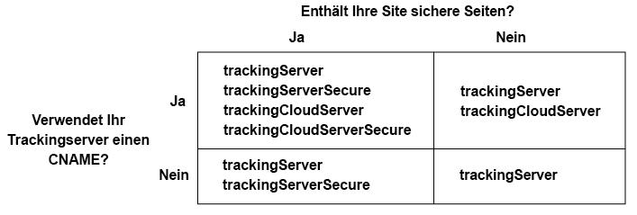

# Implementieren des Experience Cloud Identity Services für Analytics, Audience Manager und Target {#implement-the-experience-cloud-id-service-for-analytics-audience-manager-and-target}

Diese Anweisungen richten sich an Analytics-, Audience Manager- und Target-Kunden, die den Experience Cloud Identity Service verwenden möchten, nicht aber Dynamic Tag Management (DTM). Es wird allerdings dringend empfohlen, DTM zum Implementieren des ID-Diensts zu verwenden. DTM optimiert den Implementierungs-Workflow und stellt automatisch die richtige Code-Platzierung und -Sequenzierung sicher.

>[!IMPORTANT]
>
>Lesen Sie die ID-[Dienstanforderungen](../reference/requirements.md), bevor Sie beginnen, und beachten Sie die folgenden für diese Implementierung spezifischen Anforderungen:
>
>* Kunden, die s_code verwenden, können dieses Verfahren nicht durchführen. Aktualisieren Sie auf mBox-Code Version 61, um dieses Verfahren abzuschließen.
>* Konfigurieren und testen Sie den Code in einer Entwicklungsumgebung, *bevor* er in das Produktivsystem übernommen wird.


## Schritt 1: Serverseitige Weiterleitung planen {#section-880797cc992d4755b29cada7b831f1fc}

Zusätzlich zu den hier beschriebenen Schritten sollten Kunden, die [!DNL Analytics] und [!DNL Audience Manager] verwenden, zur serverseitigen Weiterleitung migrieren. Mit der Server-seitigen Weiterleitung können Sie DIL (den Datenerfassungs-Code von Audience Manager) entfernen und durch das [Audience Management-Modul](https://experienceleague.adobe.com/docs/audience-manager/user-guide/implementation-integration-guides/integration-other-solutions/audience-management-module.html?lang=de) ersetzen. Weitere Informationen finden Sie in der [Dokumentation zur Server-seitigen Weiterleitung](https://docs.adobe.com/content/help/de-DE/analytics/admin/admin-tools/server-side-forwarding/ssf.html).

Die Migration zur Server-seitigen Weiterleitung erfordert Planung und Koordinierung. Dieser Prozess umfasst externe Änderungen am Site-Code und interne Schritte, die Adobe zur Bereitstellung Ihres Kontos durchführen muss. Tatsächlich müssen viele dieser Migrationsverfahren parallel ablaufen und gemeinsam freigegeben werden. Ihr Implementierungspfad sollte dieser Abfolge von Ereignissen folgen:

1. Arbeiten Sie zum Planen der Migration Ihres ID-Diensts und der serverseitigen Weiterleitung mit Ihrem Ansprechpartner für [!DNL Analytics] und [!DNL Audience Manager] zusammen. Dabei sollte der Auswahl eines Tracking-Servers in diesem Plan eine wichtige Rolle zukommen.

1. Füllen Sie zunächst das Formular auf der [Site für Integrationen und Bereitstellungen](https://adobe.allegiancetech.com/cgi-bin/qwebcorporate.dll?idx=X8SVES) aus.

1. Implementieren Sie den ID-Dienst und das [!DNL Audience Management Module] gleichzeitig. Damit sie ordnungsgemäß funktionieren, müssen [!DNL Audience Management Module] (serverseitige Weiterleitung) und ID-Dienst für den gleichen Satz von Seiten und zur gleichen Zeit freigegeben werden.

## Schritt 2: Herunterladen des ID-Dienst-Codes {#section-0780126cf43e4ad9b6fc5fe17bb3ef86}

Für den ID-Dienst ist die `VisitorAPI.js` Code-Bibliothek erforderlich. Zum Herunterladen dieser Code-Bibliothek tun Sie Folgendes:

1. Rufen Sie **[!UICONTROL Admin > Code-Manager auf]**.
1. Klicken Sie im Code-Manager entweder auf **[!UICONTROL JavaScript (Neu)]** oder **[!UICONTROL JavaScript (Legacy)]**. Dies leitet das Herunterladen der komprimierten Code-Bibliotheken ein.

1. Entpacken Sie die Code-Datei und öffnen Sie die `VisitorAPI.js` Datei.

## Schritt 3: Hinzufügen der Funktion „Visitor.getInstance“ zum ID-Dienst-Code {#section-9e30838b4d0741658a7a492153c49f27}

>[!IMPORTANT]
>
>* In früheren Versionen der ID-Dienst-API wurde diese Funktion an einer anderen Stelle und es war eine andere Syntax erforderlich. Wenn Sie von einer Version vor [Version 1.4](../release-notes/notes-2015.md#section-f5c596f355b14da28f45c798df513572) migrieren, beachten Sie die hier beschriebene neue Platzierung und Syntax.
>* Code in GROSSBUCHSTABEN dient als Platzhalter für tatsächliche Werte. Ersetzen Sie diesen Text durch Ihre Organisations-ID, die Trackingserver-URL oder einen anderen benannten Wert.


**Teil 1: Kopieren Sie die Visitor.getInstance -Funktion unten**

```js
var visitor = Visitor.getInstance("INSERT-MARKETING-CLOUD-ORGANIZATION ID-HERE", { 
     trackingServer: "INSERT-TRACKING-SERVER-HERE", // same as s.trackingServer 
     trackingServerSecure: "INSERT-SECURE-TRACKING-SERVER-HERE", // same as s.trackingServerSecure 
 
     // To enable CNAME support, add the following configuration variables 
     // If you are not using CNAME, DO NOT include these variables 
     marketingCloudServer: "INSERT-TRACKING-SERVER-HERE", 
     marketingCloudServerSecure: "INSERT-SECURE-TRACKING-SERVER-HERE" // same as s.trackingServerSecure 
}); 
```

**Teil 2: Fügen Sie Funktions-Code zur Visitor API.js-Datei hinzu**

Platzieren Sie die `Visitor.getInstance` Funktion am Ende der Datei nach dem Code-Block. Die bearbeitete Datei sollte wie folgt aussehen:

```js
/* 
========== DO NOT ALTER ANYTHING BELOW THIS LINE ========== 
Version and copyright section 
*/ 
 
// Visitor API code library section 
 
// Put Visitor.getInstance at the end of the file, after the code library 
 
var visitor = Visitor.getInstance("INSERT-MARKETING-CLOUD-ORGANIZATION ID-HERE", { 
     trackingServer: "INSERT-TRACKING-SERVER-HERE", // same as s.trackingServer 
     trackingServerSecure: "INSERT-SECURE-TRACKING-SERVER-HERE", // same as s.trackingServerSecure 
 
     // To enable CNAME support, add the following configuration variables 
     // If you are not using CNAME, DO NOT include these variables 
     marketingCloudServer: "INSERT-TRACKING-SERVER-HERE", 
     marketingCloudServerSecure: "INSERT-SECURE-TRACKING-SERVER-HERE" // same as s.trackingServerSecure 
}); 
```

## Schritt 4: Hinzufügen der Experience Cloud-Organisations-ID zu Visitor.getInstance {#section-e2947313492546789b0c3b2fc3e897d8}

Ersetzen Sie in der `Visitor.getInstance` Funktion den Ausdruck `INSERT-MARKETING-CLOUD-ORGANIZATION ID-HERE` durch Ihre Experience Cloud-Organisations-ID. Sollten Sie Ihre Organisations-ID nicht kennen, finden Sie diese auf der Administrationsseite von Experience Cloud. Die bearbeitete Funktion sollte dem unten stehenden Beispiel ähnlich sehen.

`var visitor = Visitor.getInstance("1234567ABC@AdobeOrg", { ...`

>[!IMPORTANT]
>
>*Wichtig:* Ändern Sie die Groß- oder Kleinschreibung Ihrer Organisations-ID nicht. Bei der ID wird Groß- und Kleinschreibung beachtet und sie muss so eingegeben werden, wie sie von Adobe angegeben wird.

## Schritt 5: Hinzufügen Ihrer Tracking-Server zu Visitor.getInstance {#section-0dfc52096ac2427f86045aab9a0e0dfc}

Analytics verwendet Trackingserver für die Datenerfassung.

**Teil 1: Ermitteln der Tracking-Server-URLs**

Überprüfen Sie die Datei `s_code.js` oder `AppMeasurement.js`, um die URLs der Tracking-Server zu ermitteln. Die URLs werden von folgenden Variablen spezifiziert:

* `s.trackingServer`
* `s.trackingServerSecure`

**Teil 2: Festlegen der Trackingserver-Variablen**

So legen Sie fest, welche Trackingserver-Variablen verwendet werden sollen:

1. Beantworten Sie die Fragen in der folgenden Entscheidungsmatrix. Verwenden Sie die Variablen, die Ihren Antworten entsprechen.
1. Ersetzen Sie die Trackingserver-Platzhalter durch Ihre Trackingserver-URLs.
1. Entfernen Sie nicht verwendete Trackingserver- und Experience Cloud-Server-Variablen aus dem Code.



>[!NOTE]
>
>Prüfen Sie bei Verwendung von Experience Cloud-Server-URLs deren Übereinstimmung mit den entsprechenden Tracking-Server-URLs wie folgt:

* Experience Cloud-Server-URL = Trackingserver-URL
* Sichere Experience Cloud-Server-URL = sichere Trackingserver-URL

Wenn Sie nicht genau wissen, wie Sie Ihren Trackingserver finden, lesen Sie die [Häufig gestellte Fragen (FAQ)](../faq-intro/faq.md) und [Korrektes Ausfüllen der Variablen „trackingServer“ und „trackingServerSecure“](https://helpx.adobe.com/de/analytics/kb/determining-data-center.html#).

## Schritt 6: Aktualisieren der AppMeasurement.js-Datei {#section-5517e94a09bc44dfb492ebca14b43048}

Dieser Schritt erfordert [!UICONTROL AppMeasurement]. Sie können nicht fortfahren, wenn Sie weiterhin s_code verwenden.

Fügen Sie Ihrer `Visitor.getInstance`-Datei die im Folgenden gezeigte `AppMeasurement.js`-Funktion hinzu. Platzieren Sie sie in dem Abschnitt, in dem Konfigurationen wie `linkInternalFilters`, `charSet`, `trackDownloads` usw. enthalten sind:

`s.visitor = Visitor.getInstance("INSERT-MARKETING-CLOUD-ORGANIZATION ID-HERE");`

>[!IMPORTANT]
>
>An dieser Stelle sollten Sie den [!DNL Audience Manager] DIL-Code entfernen und durch das Audience Management-Modul ersetzen. Anweisungen finden Sie unter [Implementieren der Server-seitigen Weiterleitung](https://experienceleague.adobe.com/docs/analytics/admin/admin-tools/server-side-forwarding/ssf.html?lang=de).

***(Optional, jedoch empfohlen)* Erstellung einer benutzerspezifischen Eigenschaft.**

Festlegen einer benutzerdefinierten Eigenschaft zum Messen der Abdeckung in `AppMeasurement.js`. Fügen Sie der `doPlugins` Funktion der `AppMeasurement.js` Datei folgende benutzerspezifische Eigenschaft hinzu:

```js
// prop1 is used as an example only. Choose any available prop. 
s.prop1 = (typeof(Visitor) != "undefined" ? "VisitorAPI Present" : "VisitorAPI Missing");
```

## Schritt 7: Hinzufügen des Besucher-API-Codes zur Seite {#section-c2bd096a3e484872a72967b6468d3673}

Platzieren Sie die ` [!UICONTROL VisitorAPI.js]`-Datei innerhalb der `<head>`-Tags auf jeder Seite. Wenn Sie die `VisitorAPI.js` Datei zu Ihrer Seite hinzufügen:

* Platzieren Sie sie am Anfang des Abschnitts `<head>`, damit dies vor anderen Lösungstags angezeigt wird.
* Sie muss vor AppMeasurement und dem Code für andere [!DNL Experience Cloud]-Lösungen ausgeführt werden.

## Schritt 8: (Optional) Konfigurieren einer Übergangsphase {#section-aceacdb7d5794f25ac6ff46f82e148e1}

Wenn eines dieser Nutzungsszenarios auf Ihre Situation zutrifft, bitten Sie die [Kundenunterstützung](https://helpx.adobe.com/de/marketing-cloud/contact-support.html), eine temporäre [Übergangsphase](../reference/analytics-reference/grace-period.md) einzurichten. Übergangsphasen können bis zu 180 Tage dauern. Bei Bedarf kann eine Übergangsphase verlängert werden.

**Partielle Implementierung**

Sie benötigen eine Übergangsphase, wenn Sie einige Seiten verwalten, die den ID-Dienst verwenden, und einige Seiten, die diesen nicht verwenden, die jedoch alle in der gleichen Analytics-Report Suite aufgeführt sind. Dies ist häufig der Fall, wenn Sie eine globale Report Suite haben, die domänenübergreifend Berichte erstellt.

Beenden Sie die Übergangsphase, nachdem der ID-Dienst auf allen Webseiten bereitgestellt wurde, die in dieselbe Report Suite eingehen.

**s_vi-Cookie-Anforderungen**

Sie müssen eine Übergangsphase konfigurieren, wenn neue Besucher nach der Migration zum ID-Dienst über ein s_vi-Cookie verfügen müssen. Dies ist häufig der Fall, wenn Ihre Implementierung das s_vi-Cookie liest und es in einer Variablen speichert.

Beenden Sie die Übergangsphase, nachdem Ihre Implementierung die MID erfassen kann, anstatt das s_vi-Cookie zu lesen.

Siehe auch [Cookies und der Experience Cloud ID-Dienst](../introduction/cookies.md).

**Clickstream-Datenintegration**

Sie müssen eine Übergangsphase konfigurieren, wenn Sie Daten von einem Clickstream-Datenfeed an ein internes System senden und bei der Verarbeitung die Spalten `visid_high` und `visid_low` verwendet werden.

Sobald Ihre Datenverarbeitungsprozesse die Spalten `post_visid_high` und `post_visid_low` einsetzen können, können Sie die Übergangsphase abbrechen.

Siehe auch die [Clickstream-Datenspaltenreferenz](https://experienceleague.adobe.com/docs/analytics/export/analytics-data-feed/data-feed-overview.html?lang=de).

## Schritt 9: Testen und Verifizieren {#section-f857542bfc70496dbb9f318d6b3ae110}

Die [!DNL Experience Cloud]-Lösungen in dieser Implementierung geben IDs in der Form von Schlüssel-Wert-Paaren zurück. Jede Lösung verwendet unterschiedliche Schlüssel (z. B. die [!DNL Analytics]-SDID im Vergleich mit der mboxMCSDID von [!DNL Target]) für die Aufbewahrung derselben ID. Laden Sie zum Testen Ihrer Implementierung Ihre Seiten in einer Entwicklungsumgebung. Verwenden Sie Ihre Browserkonsole oder Software, die HTTP-Anforderungen und -Antworten überwacht, um die unten aufgeführten IDs zu überprüfen. Der ID-Dienst wurde richtig implementiert, wenn die im Folgenden aufgeführten Schlüssel-Wert-Paare dieselben ID-Werte zurückgeben.

>[!TIP]
>
>Sie können den [Adobe-Debugger](https://experienceleague.adobe.com/docs/analytics/implementation/validate/debugger.html?lang=de) oder den [Charles HTTP-Proxy](https://www.charlesproxy.com/) verwenden, um nach diesen lösungsspezifischen IDs zu suchen. Sie können jedoch frei entscheiden, welches Tool oder welcher Debugger für Sie optimal ist.

**Alle Lösungen**

Suchen Sie nach:

* [AMCV-Cookie](../introduction/cookies.md) in der Domain, auf der Ihre Seite gehostet wird.
* [!DNL Experience Cloud] ID (MID) mit dem [!DNL Adobe]-Debugger oder Ihrem bevorzugten Debuggingtool.

Weitere Prüfungen, mit denen Sie feststellen können, ob der ID-Dienst ordnungsgemäß funktioniert, finden Sie unter [Testen und Überprüfen des Experience Cloud Identity Services](../implementation-guides/test-verify.md).

**Analytics**

Suchen Sie in der JavaScript-Anforderung nach der SDID-Kennung. Die Analytics-SDID sollte mit der Target-mboxMCSDID übereinstimmen.

Wenn Ihre Tests eine AID zurückgeben, weist dies auf eine der folgenden Möglichkeiten hin:

* Sie sind ein wiederkehrender Besucher im Prozess der Migration von alten [!DNL Analytics]-IDs.
* Sie haben eine [Übergangsphase](../reference/analytics-reference/grace-period.md) aktiviert.

Wenn Sie eine AID sehen, vergleichen Sie den zugehörigen Wert mit der [!DNL Target] mboxMCAVID von. Diese Werte sind identisch, wenn der ID-Dienst korrekt implementiert wurde.

**Audience Manager**

Informationen zum Testen der Server-seitigen Weiterleitung finden Sie unter [Überprüfen der Server-seitigen Weiterleitung](https://experienceleague.adobe.com/docs/analytics/admin/admin-tools/server-side-forwarding/ssf-verify.html?lang=de).

**Target**

Suchen Sie nach:

* mboxMCGVID
* mboxMCSDID (Die mboxMCSDID sollte mit der Analytics-SDID übereinstimmen.)

Wenn Ihre Tests eine mboxMCAVID zurückgeben, weist dies auf eine der folgenden Möglichkeiten hin:

* Sie sind ein wiederkehrender Besucher im Prozess der Migration von alten [!DNL Analytics]-IDs.
* Sie haben eine Übergangsphase aktiviert.

Wenn Sie eine mboxMCAVID sehen, vergleichen Sie den zugehörigen Wert mit der [!DNL Analytics]-AID. Diese Werte sind identisch, wenn der ID-Dienst korrekt implementiert wurde.

**Implemenierung**

## Schritt 10: Bereitstellen {#section-4188fa95e7dc455a986b48a6c517c1c9}

Stellen Sie Ihren Code nach Abschluss der Tests bereit.

Wenn Sie eine Übergangsphase aktiviert haben:

* Stellen Sie sicher, dass die Bildanforderung die Analytics-ID (AID) und die MID beinhaltet.
* Denken Sie daran, die Übergangsphase nach Erfüllung der [Kriterien für eine Beendigung der Verwendung](../implementation-guides/setup-aam-analytics-target.md#section-aceacdb7d5794f25ac6ff46f82e148e1) abzubrechen.
