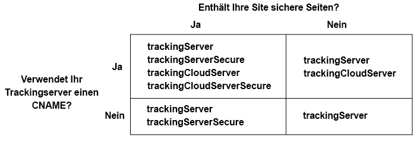

# Implementieren des Adobe-Besucher-ID-Service für Analytics und Audience Manager{#implement-the-experience-cloud-id-service-for-analytics-and-audience-manager}

Diese Anweisungen richten sich an Analytics- und Audience Manager-Kunden, die den Besucher-ID-Service verwenden möchten, nicht aber [Tags](https://experienceleague.adobe.com/docs/experience-platform/tags/home.html?lang=de). Es wird jedoch dringend empfohlen, Tags zu verwenden, um den Besucher-ID-Dienst zu implementieren. Tags vereinheitlichen den Implementierungs-Workflow und stellen automatisch sicher, dass der Code korrekt platziert und sequenziert wird.

>[!IMPORTANT]
>
>* [Lesen Sie sich die Anforderungen durch,](../reference/requirements.md) bevor Sie beginnen.
>* Dieses Verfahren erfordert AppMeasurement. Kunden, die s_code verwenden, können dieses Verfahren nicht durchführen.
>* Konfigurieren und testen Sie den Code in einer Entwicklungsumgebung, bevor er in das Produktivsystem übernommen wird.

## Schritt 1: Serverseitige Weiterleitung planen {#section-880797cc992d4755b29cada7b831f1fc}

Zusätzlich zu den hier beschriebenen Schritten sollten Kunden, die Analytics und Audience Manager verwenden, zur serverseitigen Weiterleitung migrieren. Mit der Server-seitigen Weiterleitung können Sie DIL (den Datenerfassungs-Code von Audience Manager) entfernen und durch das [Audience Management-Modul](https://experienceleague.adobe.com/docs/audience-manager/user-guide/implementation-integration-guides/integration-other-solutions/audience-management-module.html?lang=de) ersetzen. Weitere Informationen finden Sie in der [Dokumentation zur Server-seitigen Weiterleitung](https://experienceleague.adobe.com/docs/analytics/admin/admin-tools/manage-report-suites/edit-report-suite/report-suite-general/server-side-forwarding/ssf.html?lang=de).

Die Migration zur Server-seitigen Weiterleitung erfordert Planung und Koordinierung. Dieser Prozess umfasst externe Änderungen am Site-Code und interne Schritte, die Adobe zur Bereitstellung Ihres Kontos durchführen muss. Tatsächlich müssen viele dieser Migrationsverfahren parallel ablaufen und gemeinsam freigegeben werden. Ihr Implementierungspfad sollte dieser Abfolge von Ereignissen folgen:

1. Planen Sie gemeinsam mit Ihren Analytics- und Audience Manager-Kontakten die Migration Ihres Besucher-ID-Service und der Server-seitigen Weiterleitung. Dabei sollte der Auswahl eines Tracking-Servers in diesem Plan eine wichtige Rolle zukommen.

1. Füllen Sie zunächst das Formular auf der [Site für Integrationen und Bereitstellungen](https://adobe.allegiancetech.com/cgi-bin/qwebcorporate.dll?idx=X8SVES) aus.

1. Gleichzeitiges Implementieren des Besucher-ID-Service und des Audience Management-Moduls. Damit das Audience Management-Modul (Server-seitige Weiterleitung) und der Besucher-ID-Dienst ordnungsgemäß funktionieren, müssen sie für denselben Seitensatz gleichzeitig veröffentlicht werden.

## Schritt 2: Herunterladen des Besucher-ID-Dienst-Codes {#section-0780126cf43e4ad9b6fc5fe17bb3ef86}

Für den Besucher-ID-Dienst ist die `VisitorAPI.js` Code-Bibliothek erforderlich. Zum Herunterladen dieser Code-Bibliothek tun Sie Folgendes:

1. Navigieren Sie zu **[!UICONTROL Admin]** > **[!UICONTROL Code Manager]**.

1. Klicken Sie im Code-Manager entweder auf **[!UICONTROL JavaScrpt (New)]** oder auf **[!UICONTROL JavaScript (Legacy)]**. Dies leitet das Herunterladen der komprimierten Code-Bibliotheken ein.

1. Entpacken Sie die Code-Datei und öffnen Sie die `VisitorAPI.js` Datei.

## Schritt 3: Hinzufügen der Funktion Visitor.getInstance zum Besucher-ID-Dienst-Code {#section-9e30838b4d0741658a7a492153c49f27}

>[!IMPORTANT]
>
>* In früheren Versionen der Besucher-ID-Dienst-API war diese Funktion an einem anderen Speicherort abgelegt und es war eine andere Syntax erforderlich. Wenn Sie von einer Version vor [Version 1.4](../release-notes/notes-2015.md#section-f5c596f355b14da28f45c798df513572) migrieren, beachten Sie die hier beschriebene neue Platzierung und Syntax.
>* Code in GROSSBUCHSTABEN dient als Platzhalter für tatsächliche Werte. Ersetzen Sie diesen Text durch Ihre IMS-Organisations-ID, Tracking-Server-URL oder einen anderen benannten Wert.

**Teil 1: Kopieren Sie die Visitor.getInstance -Funktion unten**

```js
var visitor = Visitor.getInstance("INSERT-IMS-ORG-ID-HERE", { 
     trackingServer: "INSERT-TRACKING-SERVER-HERE", // same as s.trackingServer 
     trackingServerSecure: "INSERT-SECURE-TRACKING-SERVER-HERE", // same as s.trackingServerSecure 
 
     // To enable CNAME support, add the following configuration variables 
     // If you are not using CNAME, DO NOT include these variables 
     marketingCloudServer: "INSERT-TRACKING-SERVER-HERE", 
     marketingCloudServerSecure: "INSERT-SECURE-TRACKING-SERVER-HERE" // same as s.trackingServerSecure 
}); 
```

**Teil 2: Funktionscode zur `VisitorAPI.js` hinzufügen**

Platzieren Sie die `Visitor.getInstance` Funktion am Ende der Datei nach dem Code-Block. Die bearbeitete Datei sollte wie folgt aussehen:

```js
/* 
========== DO NOT ALTER ANYTHING BELOW THIS LINE ========== 
Version and copyright section 
*/ 
 
// Visitor API code library section 
 
// Put Visitor.getInstance at the end of the file, after the code library 
 
var visitor = Visitor.getInstance("INSERT-IMS-ORG-ID-HERE", { 
     trackingServer: "INSERT-TRACKING-SERVER-HERE", // same as s.trackingServer 
     trackingServerSecure: "INSERT-SECURE-TRACKING-SERVER-HERE", // same as s.trackingServerSecure 
 
     // To enable CNAME support, add the following configuration variables 
     // If you are not using CNAME, DO NOT include these variables 
     marketingCloudServer: "INSERT-TRACKING-SERVER-HERE", 
     marketingCloudServerSecure: "INSERT-SECURE-TRACKING-SERVER-HERE" // same as s.trackingServerSecure 
}); 
```

## Schritt 4: Hinzufügen der IMS-Organisations-ID zu Visitor.getInstance {#section-e2947313492546789b0c3b2fc3e897d8}

Ersetzen Sie in der `Visitor.getInstance` Funktion `INSERT-IMS-ORG-ID-HERE` durch Ihre IMS-Organisations-ID. Wenn Sie Ihre IMS-Organisations-ID nicht kennen, finden Sie sie auf der Verwaltungsseite für CX Enterprise. Die bearbeitete Funktion sollte dem unten stehenden Beispiel ähnlich sehen.

`var visitor = Visitor.getInstance("1234567ABC@AdobeOrg", { ...`

>[!IMPORTANT]
>
>*Ändern Sie* Groß-/Kleinschreibung der Zeichen in Ihrer IMS-Organisations-ID. Bei der ID wird Groß- und Kleinschreibung beachtet und sie muss so eingegeben werden, wie sie von Adobe angegeben wird.

## Schritt 5: Hinzufügen Ihrer Tracking-Server zu Visitor.getInstance {#section-0dfc52096ac2427f86045aab9a0e0dfc}

Analytics verwendet Trackingserver für die Datenerfassung.

**Teil 1: Ermitteln der Tracking-Server-URLs**

Überprüfen Sie die Datei `s_code.js` oder `AppMeasurement.js`, um die URLs der Tracking-Server zu ermitteln. Die URLs werden von folgenden Variablen spezifiziert:

* `s.trackingServer`
* `s.trackingServerSecure`

**Teil 2: Festlegen der Trackingserver-Variablen**

So legen Sie fest, welche Trackingserver-Variablen verwendet werden sollen:

1. Beantworten Sie die Fragen in der folgenden Entscheidungsmatrix. Verwenden Sie die Variablen, die Ihren Antworten entsprechen.
1. Ersetzen Sie die Trackingserver-Platzhalter durch Ihre Trackingserver-URLs.
1. Entfernen Sie nicht verwendete Tracking-Server- und CX Enterprise-Server-Variablen aus dem Code.



>[!NOTE]
>
>Passen Sie bei Verwendung die URLs der CX Enterprise-Server an die entsprechenden Tracking-Server-URLs an, z. B.:

* CX Enterprise Server URL = Tracking Server URL
* Sichere URL des CX Enterprise-Servers = Sichere URL des Tracking-Servers

Wenn Sie nicht genau wissen, wie Sie Ihren Trackingserver finden, lesen Sie die [Häufig gestellte Fragen (FAQ)](../faq-intro/faq.md) und [Korrektes Ausfüllen der Variablen „trackingServer“ und „trackingServerSecure“](https://helpx.adobe.com/de/analytics/kb/determining-data-center.html#).

## Schritt 6: Aktualisieren der AppMeasurement.js-Datei {#section-5517e94a09bc44dfb492ebca14b43048}

Für diesen Schritt ist [!UICONTROL AppMeasurement] erforderlich. Sie können nicht fortfahren, wenn Sie weiterhin s_code verwenden.

Fügen Sie Ihrer `Visitor.getInstance`-Datei die im Folgenden gezeigte `AppMeasurement.js`-Funktion hinzu. Platzieren Sie sie in dem Abschnitt, in dem Konfigurationen wie `linkInternalFilters`, `charSet`, `trackDownloads` usw. enthalten sind:

`s.visitor = Visitor.getInstance("INSERT-IMS-ORG-ID-HERE");`

>[!IMPORTANT]
>
>An dieser Stelle sollten Sie den Audience Manager DIL-Code entfernen und durch das Zielgruppen-Management-Modul ersetzen. Anweisungen finden Sie unter [Implementieren der Server-seitigen Weiterleitung](https://experienceleague.adobe.com/docs/analytics/admin/admin-tools/server-side-forwarding/ssf.html?lang=de).

***(Optional, jedoch empfohlen)* Erstellung einer benutzerspezifischen Eigenschaft.**

Festlegen einer benutzerdefinierten Eigenschaft zum Messen der Abdeckung in `AppMeasurement.js`. Fügen Sie der `doPlugins` Funktion der `AppMeasurement.js` Datei folgende benutzerspezifische Eigenschaft hinzu:

```js
// prop1 is used as an example only. Choose any available prop. 
s.prop1 = (typeof(Visitor) != "undefined" ? "VisitorAPI Present" : "VisitorAPI Missing");
```

## Schritt 7: Hinzufügen des Besucher-API-Codes zur Seite {#section-c2bd096a3e484872a72967b6468d3673}

Platzieren Sie die `VisitorAPI.js`-Datei innerhalb der `<head>`-Tags auf jeder Seite. Wenn Sie die `VisitorAPI.js` Datei zu Ihrer Seite hinzufügen:

* Platzieren Sie sie am Anfang des Abschnitts `<head>`, damit dies vor anderen Lösungstags angezeigt wird.
* Sie muss vor AppMeasurement und vor dem Code für andere CX Enterprise-Lösungen ausgeführt werden.

## Schritt 8: (Optional) Konfigurieren einer Übergangsphase {#section-aceacdb7d5794f25ac6ff46f82e148e1}

Wenn eines dieser Nutzungsszenarios auf Ihre Situation zutrifft, bitten Sie die [Kundenunterstützung](https://helpx.adobe.com/de/marketing-cloud/contact-support.html), eine temporäre [Übergangsphase](https://experienceleague.adobe.com/en/docs/analytics/implementation/id/migration) einzurichten. Übergangsperioden können bis zu 180 Tage dauern. Bei Bedarf kann eine Übergangsphase verlängert werden.

**Partielle Implementierung**

Sie benötigen eine Übergangsphase, wenn einige Seiten, die den Besucher-ID-Service verwenden, und einige Seiten, auf denen dies nicht der Fall ist, alle in dieselbe Analytics Report Suite berichten. Dies ist häufig der Fall, wenn Sie eine globale Report Suite haben, die domänenübergreifend Berichte erstellt.

Beenden Sie die Übergangsphase, nachdem der Besucher-ID-Service auf allen Ihren Web-Seiten bereitgestellt wurde, die Berichte in derselben Report Suite erstellen.

**s_vi-Cookie-Anforderungen**

Sie benötigen eine Übergangsphase, wenn neue Besucher nach der Migration zum Besucher-ID-Dienst über ein s_vi-Cookie verfügen müssen. Dies ist häufig der Fall, wenn Ihre Implementierung das s_vi-Cookie liest und es in einer Variablen speichert.

Beenden Sie die Übergangsphase, nachdem Ihre Implementierung die MID erfassen kann, anstatt das s_vi-Cookie zu lesen.

Siehe auch [Cookies und der Besucher-ID-Dienst](../introduction/cookies.md).

**Clickstream-Datenintegration**

Sie müssen eine Übergangsphase konfigurieren, wenn Sie Daten von einem Clickstream-Datenfeed an ein internes System senden und bei der Verarbeitung die Spalten `visid_high` und `visid_low` verwendet werden.

Sobald Ihre Datenverarbeitungsprozesse die Spalten `post_visid_high` und `post_visid_low` einsetzen können, können Sie die Übergangsphase abbrechen.

Siehe auch die [Clickstream-Datenspaltenreferenz](https://experienceleague.adobe.com/docs/analytics/export/analytics-data-feed/data-feed-overview.html?lang=de).

## Schritt 9: Testen und Bereitstellen des Besucher-ID-Dienst-Codes {#section-f857542bfc70496dbb9f318d6b3ae110}

Sie können dies wie folgt testen und bereitstellen.

**Testen und Verifizieren**

Um Ihre Implementierung des Besucher-ID-Service zu testen, überprüfen Sie Folgendes:

* [AMCV-Cookie](../introduction/cookies.md) in der Domain, auf der Ihre Seiten gehostet werden.
* MID-Wert in der Analytics-Bildanforderung mit dem [Adobe-Debugger](https://experienceleague.adobe.com/docs/analytics/implementation/validate/debugger.html?lang=de).
* Siehe auch [Testen und Überprüfen des Besucher-ID-Service](../implementation-guides/test-verify.md).

Informationen zum Überprüfen der Server-seitigen Weiterleitung finden Sie unter [Überprüfen der Server-seitigen Weiterleitung](https://experienceleague.adobe.com/docs/analytics/admin/admin-tools/server-side-forwarding/ssf-verify.html?lang=de).

**Bereitstellen**

Stellen Sie Ihren Code nach Abschluss der Tests bereit.

Wenn Sie eine Übergangsphase aktiviert haben:

* Stellen Sie sicher, dass die Bildanforderung die Analytics-ID (AID) und die MID beinhaltet.
* Denken Sie daran, die Übergangsphase nach Erfüllung der Kriterien für eine Beendigung der Verwendung abzubrechen.

