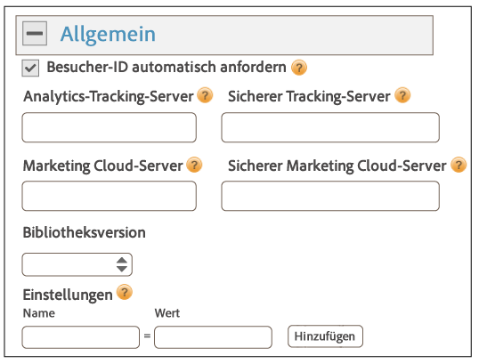
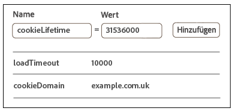
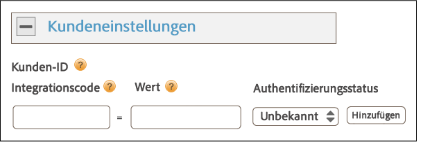

# Implementierung mit Dynamic Tag Management {#implementation-with-dynamic-tag-management}

In älteren Implementierungen wird das Dynamic Tag Management (DTM) zur Einrichtung, Bereitstellung und Integration des Experience Cloud Identity-Diensts in Ihre anderen Experience Cloud-Lösungen verwendet.

## Implementierung mit Dynamic Tag Management {#topic-6f4ed5d96977406ca991e50f3fbd5b01}

In älteren Implementierungen wird das Dynamic Tag Management (DTM) zur Einrichtung, Bereitstellung und Integration des Experience Cloud Identity-Diensts in Ihre anderen Experience Cloud-Lösungen verwendet.

>[!NOTE]
>
>Zurzeit ist [Adobe Experience Platform Launch](https://docs.adobelaunch.com/) das bevorzugte und empfohlene Implementierungstool, da es mehr Möglichkeiten als DTM bietet, komplexe Tag-Management-Aufgaben zu vereinfachen und die Codeplatzierung zu automatisieren. Siehe [Implementierung mit Launch](../implementation-guides/ecid-implement-with-launch.md).

## Dynamic Tag Management und der ID-Dienst {#section-4a4c4fac5d0a4cbbaff8e1833f73657c}

[Dynamic Tag Management](https://marketing.adobe.com/resources/help/de_DE/dtm/) ermöglicht die Konfiguration, Bereitstellung und Verwaltung Ihrer ID-Dienst-Instanz und der damit verbundenen [!DNL Experience Cloud]-Lösungsintegrationen. DTM unterstützt die Vereinfachung des Implementierungsprozesses, da es hochgradig im ID-Dienst und in andere Experience Cloud-Lösungen integriert ist. Fügen Sie einfach das Experience Cloud ID-Tool hinzu, konfigurieren Sie es und geben Sie Informationen an, beispielsweise:

* Experience Cloud-Organisations-ID (wird bei der Verknüpfung mit Experience Cloud automatisch ausgefüllt)
* Analytics-Tracking-Server (sicherer und nicht sicherer)
* Experience Cloud-Server (für Tracking-Server von Erstanbietern)

DTM ist für [!DNL Experience Cloud]-Kunden kostenlos verfügbar.

**Erste Schritte mit DTM**

DTM ist ein einfaches aber leistungsstarkes Tool. Falls Sie es nicht bereits verwenden, raten wir Ihnen dringend dazu. Lesen Sie die DTM-[Dokumentation](https://marketing.adobe.com/resources/help/de_DE/dtm/c_overview.html) und [DTM Jump Start Videos](https://marketing.adobe.com/resources/help/de_DE/dtm/jump-start-videos.html), um mit diesem Dienst zu beginnen. Anweisungen zur Einrichtung des ID-Diensts mit DTM finden Sie in den Informationen und Verfahren in den folgenden Abschnitten.

## Implementierungsrichtlinien {#concept-54a2ec49af8f4bfca9207b1d404e8e1a}

Lesen Sie diese Anforderungen und Verfahren, bevor Sie versuchen, den Experience Cloud Identity-Dienst im Dynamic Tag Management (DTM) zu integrieren.

<!--
mcvid-dtm-deployment.xml
-->

**Bereitstellen von Konten**

Stellen Sie zunächst sicher, dass Ihre Organisation und Ihre Lösungen für die [!DNL Experience Cloud] bereitgestellt wurden und Sie mit dem [!DNL Dyanamic Tag Management] vertraut sind. Diese Dokumentationen helfen bei den ersten Schritten:

* [Aktivieren Sie Ihre Lösungen für die Kerndienste](https://marketing.adobe.com/resources/help/de_DE/mcloud/core_services.html): Implementieren Sie Experience Cloud und werden Sie Administrator. Durch diesen Prozess werden Ihre Lösungen bezüglich der zentralen Dienste wie Kundenattribute und Experience Cloud-Zielgruppen modernisiert.
* [Erste Schritte mit Dynamic Tag Management](https://marketing.adobe.com/resources/help/de_DE/dtm/get_started.html)
* [Jump Start Videos](https://marketing.adobe.com/resources/help/de_DE/dtm/jump-start-videos.html): Eine Reihe von kurzen Videos, die die Durchführung elementarer DTM-Aufgaben demonstriert.

**ID-Dienst-Codeplatzierung und -Ladereihenfolge**

Der ID-Dienst funktioniert durch das Anfordern und Empfangen einer eindeutigen ID von den [!DNL Adobe]-Datenerfassungsservern. Für eine ordnungsgemäße Funktion muss Ihr ID-Dienstcode:

* der erste Block des [!DNL Adobe]-Codes sein, der auf der Seite ausgeführt wird.
* Möglichst weit oben auf der Seite platziert sein, für gewöhnlich im `<head>` Codeblock.

Solange Sie all Ihre [!DNL Adobe]-Lösungen und -Codebibliotheken in DTM aufbewahren, ist sichergestellt, dass Ihr ID-Dienstcode an der richtigen Position platziert und zur richtigen Zeit ausgelöst wird.

**Validieren der regionalen Datenerfassung**

Der Kunde muss einen CNAME angeben oder `*.sc.omtrdc` für die [regionale Datenerhebung](https://marketing.adobe.com/resources/help/de_DE/whitepapers/rdc/) (RDC) verwenden. Erfragen Sie die jeweiligen RDC-Einstellungen bei Ihrem [!DNL Adobe]-Berater.

**Konfigurieren von Analytics Report Suites**

Neue [!DNL Analytics]-Kunden sollten zur Datenerfassung eine [Berichtssuite anlegen](https://marketing.adobe.com/resources/help/de_DE/reference/new_report_suite.html).

## Implementieren des Experience Cloud Identity-Diensts in DTM {#task-a659cf19dea84ad48edabe0b72ef9f5c}

Befolgen Sie diese Schritte, um den ID-Dienst im Dynamic Tag Management (DTM) zu implementieren.

**Voraussetzungen**

* Aktivieren Sie Ihre Lösungen für die [!DNL Experience Cloud] und stellen Sie sicher, dass Sie über Administratorberechtigungen verfügen. Siehe [Enable your solutions for core services](https://marketing.adobe.com/resources/help/de_DE/mcloud/core_services.html).

* Erstellen Sie eine Webeigenschaft in DTM. Siehe die DTM [Create a Web Property](https://marketing.adobe.com/resources/help/de_DE/dtm/web_property.html)-Dokumentation oder das [Admin Jump Start Video](https://marketing.adobe.com/resources/help/de_DE/dtm/admin-jump-start.html).

<!--
mcvid-dtm-implement.xml
-->

**Implementierungsschritte** So implementieren Sie den ID-Dienst in DTM:

1. Klicken Sie im DTM-[!UICONTROL Dashboard] auf die gewünschte Webeigenschaft.
1. Klicken Sie auf der Registerkarte **[!UICONTROL Überblick]** Ihrer ausgewählten Webeigenschaft auf **[!UICONTROL Tool hinzufügen]**.
1. Klicken Sie in der **[!UICONTROL Tooltyp-]** Liste auf **[!UICONTROL Experience Cloud Identity-Dienst]**.

   >[!NOTE]
   >
   >Durch diese Aktion wird das Feld **[!UICONTROL Experience Cloud-Organisations-ID]** mit Ihrer Organisations-ID ausgefüllt. Wenn Ihr DTM-Konto nicht mit der [!DNL Experience Cloud] verknüpft ist, müssen Sie diese ID angeben. Informationen zur Verknüpfung Ihres Kontos finden Sie unter [Verknüpfung von Konten in Experience Cloud](https://marketing.adobe.com/resources/help/de_DE/mcloud/organizations.html). Informationen für die Suche nach Ihrer Organisations-ID finden Sie bei diesen [Anforderungen](../reference/requirements.md#section-a02f537129a64ffbb690d5738d360c26).

1. Geben Sie den Namen Ihres Tracking-Servers im Feld **[!UICONTROL Tracking-Server]** ein. Wenn Sie nicht genau wissen, wie Sie Ihren Tracking-Server finden, lesen Sie [FAQ](../faq-intro/faq.md) und [Korrektes Ausfüllen der Variablen „trackingServer“ und „trackingServerSecure“](https://helpx.adobe.com/de/analytics/kb/determining-data-center.html#) an.
1. Klicken Sie auf **[!UICONTROL Tool erstellen]** und auf **[!UICONTROL Änderungen speichern]**.

   Nach dem Speichern wird der ID-Dienst als ein Tool in DTM eingerichtet. Er kann jedoch noch nicht verwendet werden. Ihr DTM-Tool muss zunächst den DTM-Veröffentlichungs-/Genehmigungsprozess durchlaufen. Zudem können Sie zusätzliche Parameter konfigurieren. Informationen zum DTM-Genehmigungsverfahren finden Sie im Video [User Basics Jump Start](https://marketing.adobe.com/resources/help/de_DE/dtm/user-basics-jump-start.html). Informationen zu den zusätzlichen Parametern, die Sie zum DTM hinzufügen können, finden Sie unter [Experience Cloud Identity-Diensteinstellungen für DTM](../implementation-guides/standard.md#concept-fb6cb6a0e6cc4f10b92371f8671f6b59).

>[!MORE_LIKE_THIS]
>
>* [Web Properties](https://marketing.adobe.com/resources/help/de_DE/dtm/web_property.html)


## Experience Cloud Identity-Diensteinstellungen für DTM {#concept-fb6cb6a0e6cc4f10b92371f8671f6b59}

Beschreibt die Felder [!UICONTROL Organisations-ID], [!UICONTROL Allgemein] und [!UICONTROL Kundeneinstellungen] und ihre Verwendung durch den [!DNL Experience Cloud] ID-Dienst.

<!--
mcvid-dtm-settings.xml
-->

## Wie finde ich diese Einstellungen? {#section-c5b2d1c928944ae2b8565c1b182fe575}

Die Einstellungen stehen nach dem Hinzufügen und Speichern des ID-Dienstes als ein Tool im Dynamic Tag Management (DTM) zur Verfügung. Sie können auch auf diese Einstellungen zugreifen, indem Sie im Abschnitt [!UICONTROL Installierte Tools] Ihrer DTM-Webeigenschaft auf das Zahnradsymbol klicken.


## Organisations-ID {#section-949b5a0d8af940558b04ff675cf53f77}

Dies ist die für Ihr bereitgestelltes [!DNL Experience Cloud]-Unternehmen erforderliche und mit ihm verknüpfte ID. Bei einer Organisation handelt es sich um die Entität, die einem Administrator das Konfigurieren von Benutzern und Gruppen sowie das Steuern des Single Sign-On-Zugriffs in der [!DNL Experience Cloud] ermöglicht. Die Organisations-ID besteht aus einer 24-stelligen alphanumerischen Zeichenfolge, gefolgt von (dem obligatorischen) @AdobeOrg. [!DNL Experience Cloud] Administratoren finden diese ID unter [Experience Cloud &gt; Tools](https://marketing.adobe.com/resources/help/de_DE/mcloud/admin_getting_started.html).


Siehe auch [Cookies und der Experience Cloud Identity-Dienst](../introduction/cookies.md).

## Allgemeine Einstellungen {#section-071d358e40f84629a8901b893dd61392}

Mit diesen Einstellungen können Sie Tracking-Server angeben, Versionen codieren und andere Variablen hinzufügen.



In der folgenden Tabelle sind die [!UICONTROL allgemeinen] Einstellungen aufgeführt und definiert.

**Besucher-ID automatisch anfordern**

Sofern aktiviert, ruft Dynamic Tag Management automatisch die Methode `getMarketingCloudVisitorID()` vor dem Laden von Adobe-Lösungen auf, die den Experience Cloud Identity-Dienst verwenden.

Siehe [getMarketingCloudVisitorID](../library/get-set/getmcvid.md).

**Analytics-Tracking-Server**

Der Name des für die Analysedatenerfassung verwendeten Tracking-Servers. Dies ist die Domäne, auf der die Bildanforderung und das Cookie geschrieben werden (z. B. `http://site.omtrdc.net`).

Überprüfen Sie die Dateien `s_code.js` oder `AppMeasurement.js`, sofern Sie Ihre Tracking-Server-URLs nicht kennen. Sie möchten, dass die URL durch die `s.trackingServer` Variable festgelegt wird.

Siehe [trackingServer](https://marketing.adobe.com/resources/help/de_DE/sc/implement/trackingServer.html) und [Korrektes Ausfüllen der Variablen trackingServer und trackingServerSecure](https://helpx.adobe.com/de/analytics/kb/determining-data-center.html#).

**Sicherer Tracking-Server**

Der Name des für die Analysedatenerfassung verwendeten sicheren Tracking-Servers. Dies ist die Domäne, auf der die Bildanforderung und das Cookie geschrieben werden (z. B. `https://site.omtrdc.net`).

Überprüfen Sie die Dateien `s_code.js` oder `AppMeasurement.js`, sofern Sie Ihre Tracking-Server-URLs nicht kennen. Sie möchten, dass die URL durch die `s.trackingServerSecure` Variable festgelegt wird.

Siehe [trackingServer](https://marketing.adobe.com/resources/help/de_DE/sc/implement/trackingServer.html) und [Korrektes Ausfüllen der Variablen trackingServer und trackingServerSecure](https://helpx.adobe.com/de/analytics/kb/determining-data-center.html#).

**Experience Cloud-Server**

Wenn Ihr Unternehmen die Erstanbieter-Datenerfassung (CNAME) nutzt, um Erstanbieter-Cookies in einem Drittanbieter-Kontext zu verwenden, geben Sie hier den Tracking-Server ein (z. B. `http://metrics.company.com`).

**Sicherer Experience Cloud-Server**

Wenn Ihr Unternehmen die Erstanbieter-Datenerfassung (CNAME) nutzt, um Erstanbieter-Cookies in einem Drittanbieter-Kontext zu verwenden, geben Sie hier den Tracking-Server ein (z. B. `https://metrics.company.com`).

**Bibliotheksversion**

Legt die Version der gewünschten ID-Dienstcodebibliothek (`VisitorAPI.js`) fest. Sie können diese Menüoptionen nicht bearbeiten.

**Einstellungen**

Mithilfe dieser Felder können Sie [Funktionsvariablen](../library/function-vars/function-vars.md) als Schlüssel-Wert-Paare hinzufügen. Klicken Sie auf **[!UICONTROL Hinzufügen]**, um Ihrer ID-Dienstimplementierung mindestens eine Variable hinzuzufügen.



>[!IMPORTANT]
>
>Hier die `cookieDomain`-Variable setzen. Sie ist für mehrteilige Top-Level-Domänen erforderlich, bei denen einer der beiden letzten Teile der URL mindestens zwei Zeichen lang ist. Siehe die oben verlinkte Dokumentation zu den Konfigurationsvariablen.

## Kundeneinstellungen {#section-238d1272c1504d148fe38fb0ae5d71c2}

Zusätzliche Felder, mit denen Sie einen Integrationscode oder authentifizierten Status hinzufügen können.



**Integrationscode**

Bei einem Integrationscode handelt es sich um eine eindeutige, vom Kunden bereitgestellte ID. Der Integrationscode sollte den Wert enthalten, mit dem Sie [eine Datenquelle angelegt haben](https://marketing.adobe.com/resources/help/en_US/aam/create-datasource.html) in [!DNL Audience Manager].

**Wert**

Beim Wert sollte es sich um das die Benutzer-ID enthaltende Datenelement handeln. Bei Datenelementen handelt es sich um für dynamische Werte, beispielsweise IDs von einem clientspezifischen internen System, geeignete Container.

**Authentifizierungsstatus**

Optionen, die Besucher gemäß ihrem Authentifizierungsstatus (z. B. angemeldet, abgemeldet) definieren oder identifizieren. Siehe [Kunden-IDs und Authentifizierungsstatus](../reference/authenticated-state.md).

## Testen und Überprüfen des Experience Cloud Identity-Diensts{#concept-644fdbef433b46ba9c0634ac95eaa680}

Diese Anweisungen, Tools und Verfahren unterstützen Sie bei der Ermittlung, ob der ID-Dienst ordnungsgemäß funktioniert. Diese Tests gelten für den ID-Dienst im Allgemeinen sowie für andere ID-Dienst- und [!DNL Experience Cloud]-Lösungskombinationen.

<!--
mcvid-test-verify.xml
-->

## Voraussetzungen {#section-b1e76ad552ed4eb793b6e521a55127d4}

Wichtige Informationen, die Sie vor Testen und Verifizieren des ID-Diensts kennen sollten.

**Browserumgebungen**

Löschen Sie beim Testen in einer normalen Browsersitzung vor jedem Test Ihren Browsercache.

Alternativ können Sie den ID-Dienst in einer anonymen oder Inkognito-Browsersitzung testen. In einer anonymen Sitzung müssen Sie nicht vor jedem Test Ihre Browsercookies oder den Browsercache löschen.

**Tools**

Mithilfe des [Adobe-Debugger](https://marketing.adobe.com/resources/help/de_DE/sc/implement/debugger.html) und des [Charles HTTP-Proxy](https://www.charlesproxy.com/) können Sie feststellen, ob der ID-Dienst so konfiguriert wurde, dass er mit Analytics ordnungsgemäß funktioniert. Die Informationen in diesem Abschnitt basieren auf den durch den Adobe-Debugger und Charles zurückgegebenen Ergebnissen. Sie können jedoch frei entscheiden, welches Tool oder welcher Debugger für Sie optimal ist.

## Testen mit dem Adobe-Debugger {#section-861365abc24b498e925b3837ea81d469}

Ihre Dienstintegration ist richtig konfiguriert, wenn in der [!DNL Adobe]-Debugger-Antwort eine [!DNL Experience Cloud ID] (MID) angezeigt wird. Siehe [Cookies und der Experience Cloud Identity-Dienst](../introduction/cookies.md) mit weiteren Informationen zur MID.

So überprüfen Sie den Status des ID-Diensts mit dem [!DNL Adobe] [Debugger](https://marketing.adobe.com/resources/help/de_DE/sc/implement/debugger.html):

1. Löschen Sie Ihre Browsercookies oder öffnen Sie eine anonyme Browsersitzung.
1. Laden Sie Ihre Testseite, die den ID-Dienstcode enthält.
1. Öffnen Sie den [!DNL Adobe]-Debugger.
1. Suchen Sie in den Ergebnissen nach einer MID.

## Grundlegendes zu den Adobe-Debugger-Ergebnissen {#section-bd2caa6643d54d41a476d747b41e7e25}

Die MID wird in einem Schlüssel-Wert-Paar gespeichert, das die folgende Syntax verwendet: `MID= *`Experience Cloud ID`*`. Der Debugger zeigt diese Informationen wie unten gezeigt an.

**Erfolg**

Der ID-Dienst wurde richtig implementiert, wenn eine Antwort wie die folgende angezeigt wird:

```
mid=20265673158980419722735089753036633573
```

Wenn Sie ein [!DNL Analytics]-Kunde sind, wird zusätzlich zur MID eine [!DNL Analytics] ID (AID) angezeigt. Dies geschieht:

* bei einigen Ihrer aktuellen/langjährigen Sitebesucher,
* wenn Sie eine Übergangsphase aktiviert haben.

**Fehler**

Wenden Sie sich an den [Kundendienst](https://helpx.adobe.com/de/marketing-cloud/contact-support.html), wenn der Debugger:

* keine MID zurückgibt,
* eine Fehlermeldung zurückgibt, die besagt, dass Ihre Partner-ID nicht bereitgestellt wurde.

## Testen mit dem Charles-HTTP-Proxy {#section-d9e91f24984146b2b527fe059d7c9355}

So überprüfen Sie den Status des ID-Diensts mit Charles:

1. Löschen Sie Ihre Browsercookies oder öffnen Sie eine anonyme Browsersitzung.
1. Starten Sie Charles.
1. Laden Sie Ihre Testseite, die den ID-Dienstcode enthält.
1. Suchen Sie nach den unten beschriebenen Anforderungs- und Antwortaufrufen und -daten.

## Grundlegendes zu den Charles-Ergebnissen {#section-c10c3dc0bb9945cbaffcf6fec7082fab}

Lesen Sie diesen Abschnitt, um Informationen dahingehend zu erhalten, wo und wonach Sie suchen müssen, wenn Sie Charles zum Überwachen von HTTP-Aufrufen verwenden.

### Erfolgreiche ID-Dienstanforderungen in Charles

Ihr ID-Dienst-Code funktioniert ordnungsgemäß, wenn die Funktion `Visitor.getInstance` einen JavaScript-Aufruf zu `dpm.demdex.net` startet. Eine erfolgreiche Anforderung enthält Ihre [Organisations-ID](../reference/requirements.md#section-a02f537129a64ffbb690d5738d360c26). Die Organisations-ID wird als Schlüssel-Wert-Paar weitergegeben, das folgende Syntax verwendet: `d_orgid= *`d_orgid`*`. Die `dpm.demdex.net`- und JavaScript-Aufrufe finden Sie auf der Registerkarte [!UICONTROL Struktur]. Die Organisations-ID finden Sie auf der Registerkarte [!UICONTROL „Anforderung“].


### Erfolgreiche ID-Dienstantworten in Charles

Ihr Konto wurde für den ID-Dienst korrekt erstellt, wenn die Antwort der [Datensammelserver](https://marketing.adobe.com/resources/help/en_US/aam/c_compcollect.html) (Data Collection Server, DCS) eine MID zurückgibt. Die MID wird als ein Schlüssel-Wert-Paar zurückgegeben, das die folgende Syntax verwendet: `d_mid: visitor Experience Cloud ID`. Auf der Registerkarte [!UICONTROL „Antwort“] findet sich die MID, wie im Folgenden gezeigt.


### Fehlerhafte ID-Dienstantworten in Charles

Ihr Konto wurde nicht richtig bereitgestellt, wenn die MID in der DCS-Antwort fehlt. Bei einer fehlerhaften Antwort werden auf der Registerkarte [!UICONTROL „Antwort“] ein Fehlercode und eine Fehlermeldung zurückgegeben, wie im Folgenden gezeigt. Wenden Sie sich an den Kundendienst, wenn diese Fehlermeldung in der DCS-Antwort angezeigt wird.


Weitere Informationen zu Fehlercodes finden Sie unter [DCS-Fehlercodes, Meldungen und Beispiele](https://marketing.adobe.com/resources/help/en_US/aam/dcs_error_codes.html).
