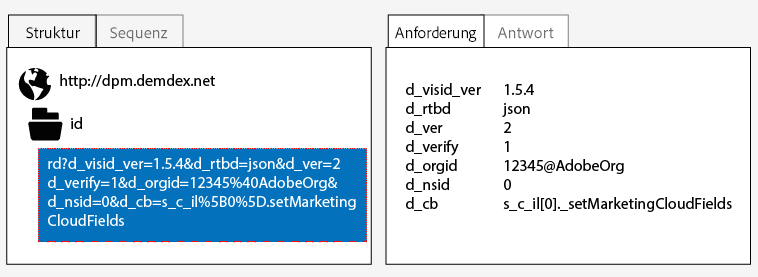
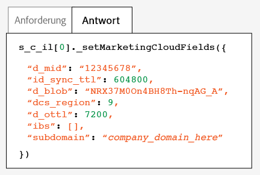
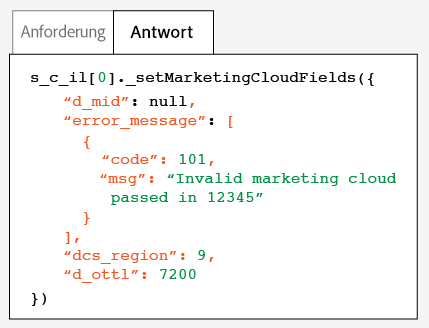

# Test and verify the Experience Cloud Identity Service{#test-and-verify-the-experience-cloud-id-service}

Diese Anweisungen, Tools und Verfahren unterstützen Sie bei der Ermittlung, ob der ID-Dienst ordnungsgemäß funktioniert. Diese Tests gelten für den ID-Dienst im Allgemeinen und für andere ID-Dienst- und Experience Cloud-Lösungskombinationen.

## Voraussetzungen {#section-b1e76ad552ed4eb793b6e521a55127d4}

Wichtige Informationen, die Sie vor Testen und Verifizieren des ID-Diensts kennen sollten.

**Browserumgebungen**

Löschen Sie beim Testen in einer normalen Browsersitzung vor jedem Test Ihren Browsercache.

Alternativ können Sie den ID-Dienst in einer anonymen oder Inkognito-Browsersitzung testen. In einer anonymen Sitzung müssen Sie nicht vor jedem Test Ihre Browsercookies oder den Browsercache löschen.

**Tools**

Der [Adobe-Debugger](https://marketing.adobe.com/resources/help/en_US/sc/implement/debugger.html) und der [Charles-HTTP-Proxy](https://www.charlesproxy.com/) können Ihnen dabei helfen, zu bestimmen, ob der ID-Dienst für die richtige Funktionsweise mit Analytics konfiguriert wurde. Die Informationen in diesem Abschnitt basieren auf den durch den Adobe-Debugger und Charles zurückgegebenen Ergebnissen. Sie können jedoch frei entscheiden, welches Tool oder welcher Debugger für Sie optimal ist.

## Testen mit dem Adobe-Debugger {#section-861365abc24b498e925b3837ea81d469}

Ihre Dienstintegration ist richtig konfiguriert, wenn in der [!DNL Adobe]-Debugger-Antwort eine [!DNL Experience Cloud ID] (MID) angezeigt wird. See [Cookies and the Experience Cloud Identity Service](../introduction/cookies.md) for more information about the MID.

So überprüfen Sie den Status des ID-Diensts mit dem [!DNL Adobe][-Debugger](https://marketing.adobe.com/resources/help/en_US/sc/implement/debugger.html):

1. Löschen Sie Ihre Browsercookies oder öffnen Sie eine anonyme Browsersitzung.
1. Laden Sie Ihre Testseite, die den ID-Dienstcode enthält.
1. Öffnen Sie den [!DNL Adobe]-Debugger.
1. Suchen Sie in den Ergebnissen nach einer MID.

## Grundlegendes zu den Adobe-Debugger-Ergebnissen {#section-bd2caa6643d54d41a476d747b41e7e25}

Die MID wird in einem Schlüssel-Wert-Paar gespeichert, das die folgende Syntax verwendet: `MID= *`Experience Cloud ID`*`. Der Debugger zeigt diese Informationen wie unten gezeigt an.

**Erfolg**

Der ID-Dienst wurde richtig implementiert, wenn eine Antwort wie die folgende angezeigt wird:

```
mid=20265673158980419722735089753036633573
```

Wenn Sie ein [!DNL Analytics]-Kunde sind, wird zusätzlich zur MID eine [!DNL Analytics] ID (AID) angezeigt. Dies geschieht:

* bei einigen Ihrer aktuellen/langjährigen Sitebesucher,
* wenn Sie eine Übergangsphase aktiviert haben.

**Fehler**

Wenden Sie sich an den [Kundendienst](https://helpx.adobe.com/marketing-cloud/contact-support.html), wenn der Debugger:

* keine MID zurückgibt,
* eine Fehlermeldung zurückgibt, die besagt, dass Ihre Partner-ID nicht bereitgestellt wurde.

## Testen mit dem Charles-HTTP-Proxy {#section-d9e91f24984146b2b527fe059d7c9355}

So überprüfen Sie den Status des ID-Diensts mit Charles:

1. Löschen Sie Ihre Browsercookies oder öffnen Sie eine anonyme Browsersitzung.
1. Starten Sie Charles.
1. Laden Sie Ihre Testseite, die den ID-Dienstcode enthält.
1. Suchen Sie nach den unten beschriebenen Anforderungs- und Antwortaufrufen und -daten.

## Grundlegendes zu den Charles-Ergebnissen {#section-c10c3dc0bb9945cbaffcf6fec7082fab}

Lesen Sie diesen Abschnitt, um Informationen dahingehend zu erhalten, wo und wonach Sie suchen müssen, wenn Sie Charles zum Überwachen von HTTP-Aufrufen verwenden.

**Erfolgreiche ID-Dienstanforderungen in Charles**

Ihr ID-Dienst-Code funktioniert ordnungsgemäß, wenn die Funktion `Visitor.getInstance` einen JavaScript-Aufruf zu `dpm.demdex.net` startet. Eine erfolgreiche Anforderung enthält Ihre [Organisations-ID](../reference/requirements.md#section-a02f537129a64ffbb690d5738d360c26). Die Organisations-ID wird als Schlüssel-Wert-Paar weitergegeben, das folgende Syntax verwendet: `d_orgid= *`d_orgid`*`. Look for the `dpm.demdex.net` and the JavaScript calls under the [!UICONTROLStructure] tab. Look for your Organization ID under the [!UICONTROLRequest] tab.



**Erfolgreiche ID-Dienstantworten in Charles**

Ihr Konto wurde ordnungsgemäß für den ID-Dienst bereitgestellt, wenn die Antwort von den [Datenerfassungsservern (Data Collection Servers, DCS)](https://marketing.adobe.com/resources/help/en_US/aam/c_compcollect.html) eine MID zurückgibt. Die MID wird als ein Schlüssel-Wert-Paar zurückgegeben, das die folgende Syntax verwendet: `d_mid: *`visitor Experience Cloud ID`*`. Look for the MID in the [!UICONTROLResponse] tab as shown below.



**Fehlerhafte ID-Dienstantworten in Charles**

Ihr Konto wurde nicht richtig bereitgestellt, wenn die MID in der DCS-Antwort fehlt. An unsuccessful response returns an error code and message in the [!UICONTROLResponse] tab as shown below. Wenden Sie sich an den Kundendienst, wenn diese Fehlermeldung in der DCS-Antwort angezeigt wird.



Weitere Informationen über Fehlercodes finden Sie im Thema über die [DCS-Fehlercodes, -Meldungen und -Beispiele](https://marketing.adobe.com/resources/help/en_US/aam/dcs_error_codes.html).
