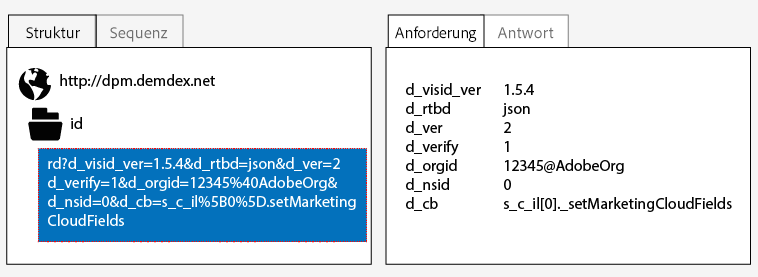
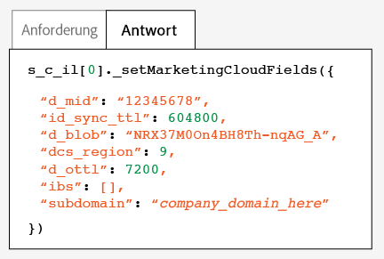
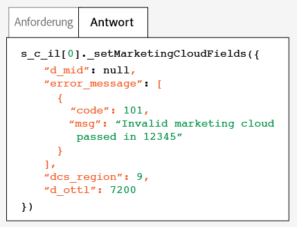

# Testen und Überprüfen des Besucher-ID-Service von Adobe{#test-and-verify-the-experience-cloud-id-service}

Mithilfe dieser Anweisungen, Tools und Verfahren können Sie feststellen, ob der Besucher-ID-Dienst ordnungsgemäß funktioniert. Diese Tests gelten für den Besucher-ID-Dienst im Allgemeinen und für verschiedene Kombinationen aus Besucher-ID-Dienst und CX Enterprise-Lösung.

## Voraussetzungen {#section-b1e76ad552ed4eb793b6e521a55127d4}

Wichtige Informationen, die Sie kennen sollten, bevor Sie mit dem Testen und Überprüfen des Besucher-ID-Service beginnen.

**Browserumgebungen**

Löschen Sie beim Testen in einer normalen Browsersitzung vor jedem Test Ihren Browsercache.

Alternativ können Sie den Besucher-ID-Dienst in einer anonymen oder inkognito-Browser-Sitzung testen. In einer anonymen Sitzung müssen Sie Ihre Browser-Cookies oder den Cache nicht vor jedem Test löschen.

**Tools**

Der [Adobe-Debugger](https://experienceleague.adobe.com/docs/analytics/implementation/validate/debugger.html?lang=de) und der [Charles HTTP-Proxy](https://www.charlesproxy.com/) können Ihnen dabei helfen festzustellen, ob der Besucher-ID-Dienst für die ordnungsgemäße Verwendung mit Analytics konfiguriert wurde. Die Informationen in diesem Abschnitt basieren auf den durch den Adobe-Debugger und Charles zurückgegebenen Ergebnissen. Sie können jedoch frei entscheiden, welches Tool oder welcher Debugger für Sie optimal ist.

## Testen mit dem Adobe-Debugger {#section-861365abc24b498e925b3837ea81d469}

Ihre Dienstintegration ist richtig konfiguriert, wenn in der Adobe-Debugger-Antwort eine ECID angezeigt wird. Siehe [Cookies und der Besucher-ID-](../introduction/cookies.md)) für weitere Informationen zur MID.

So überprüfen Sie den Status des Besucher-ID-Service mit dem Adobe [Debugger](https://experienceleague.adobe.com/docs/analytics/implementation/validate/debugger.html?lang=de):

1. Löschen Sie Ihre Browser-Cookies oder öffnen Sie eine anonyme Browser-Sitzung.
1. Laden Sie Ihre Testseite, die den Besucher-ID-Service-Code enthält.
1. Öffnen Sie den Adobe-Debugger.
1. Suchen Sie in den Ergebnissen nach einer MID.

## Grundlegendes zu den Adobe-Debugger-Ergebnissen {#section-bd2caa6643d54d41a476d747b41e7e25}

Die MID wird in einem Schlüssel-Wert-Paar gespeichert, das diese Syntax verwendet: `MID= *`ECID`*`. Der Debugger zeigt diese Informationen wie unten gezeigt an.

**Erfolg**

Der Besucher-ID-Dienst wurde ordnungsgemäß implementiert, wenn Sie eine Antwort sehen, die in etwa wie folgt aussieht:

```
mid=20265673158980419722735089753036633573
```

Wenn Sie Analytics-Kunde sind, wird möglicherweise zusätzlich zur MID eine Analytics-ID (AID) angezeigt. Dies geschieht:

* bei einigen Ihrer aktuellen/langjährigen Sitebesucher,
* Wenn Sie haben eine Übergangsphase aktiviert haben.

**Fehlgeschlagen**

Wenden Sie sich an die [Kundenunterstützung](https://helpx.adobe.com/de/marketing-cloud/contact-support.html), wenn der Debugger:

* keine MID zurückgibt,
* eine Fehlermeldung zurückgibt, die angibt, dass Ihre Partner-ID nicht bereitgestellt wurde.

## Testen mit dem Charles-HTTP-Proxy {#section-d9e91f24984146b2b527fe059d7c9355}

So überprüfen Sie den Status des Besucher-ID-Service mit Charles:

1. Löschen Sie Ihre Browser-Cookies oder öffnen Sie eine anonyme Browser-Sitzung.
1. Starten Sie Charles.
1. Laden Sie Ihre Testseite, die den Besucher-ID-Service-Code enthält.
1. Suchen Sie nach den unten beschriebenen Anforderungs- und Antwortaufrufen und -daten.

## Grundlegendes zu den Charles-Ergebnissen {#section-c10c3dc0bb9945cbaffcf6fec7082fab}

Lesen Sie diesen Abschnitt, um Informationen dahingehend zu erhalten, wo und wonach Sie suchen müssen, wenn Sie Charles zum Überwachen von HTTP-Aufrufen verwenden.

**Erfolgreiche Besucher-ID-Service-Anfragen in Charles**

Ihr Besucher-ID-Dienst-Code funktioniert ordnungsgemäß, wenn die `Visitor.getInstance` einen JavaScript-Aufruf an `dpm.demdex.net` durchführt. Eine erfolgreiche Anfrage enthält Ihre [IMS-Organisations-ID](../reference/requirements.md#section-a02f537129a64ffbb690d5738d360c26). Die IMS-Organisations-ID wird als Schlüssel-Wert-Paar übergeben, das diese Syntax verwendet: `d_orgid= *`IMS-Organisations-ID`*`. Die `dpm.demdex.net`- und die JavaScript-Aufrufe finden Sie auf Registerkarte [!UICONTROL Structure]. Suchen Sie auf der Registerkarte &quot;[!UICONTROL Request]&quot; nach Ihrer IMS-Organisations-ID.



**Erfolgreiche Antworten des Besucher-ID-Service in Charles**

Ihr Konto wurde korrekt für den Besucher-ID-Service bereitgestellt, wenn die Antwort der [Datenerfassungsserver“ (](https://experienceleague.adobe.com/docs/audience-manager/user-guide/reference/system-components/components-data-collection.html?lang=de)) eine MID zurückgibt. Die MID wird als Schlüssel-Wert-Paar zurückgegeben, das diese Syntax verwendet: `d_mid: *`Besucher-ECID`*`. Auf der Registerkarte [!UICONTROL Response] finden Sie die MID wie nachstehend dargestellt.



**Fehlgeschlagene Antworten des Besucher-ID-Service in Charles**

Ihr Konto wurde nicht richtig bereitgestellt, wenn die MID in der DCS-Antwort fehlt. Bei einer fehlerhaften Antwort werden auf der Registerkarte [!UICONTROL Response] ein Fehlercode und eine Fehlermeldung zurückgegeben wie nachstehend dargestellt. Wenden Sie sich an die Kundenunterstützung, wenn diese Fehlermeldung in der DCS-Antwort angezeigt wird.



Weitere Informationen zu Fehler-Codes finden Sie unter [DCS-Fehler-Codes, Meldungen und Beispiele](https://experienceleague.adobe.com/docs/audience-manager/user-guide/api-and-sdk-code/dcs/dcs-api-reference/dcs-error-codes.html?lang=de).

