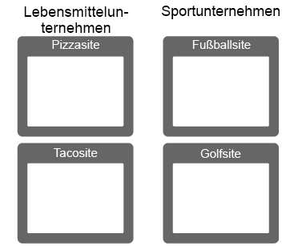
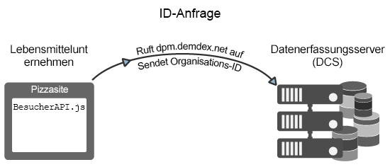
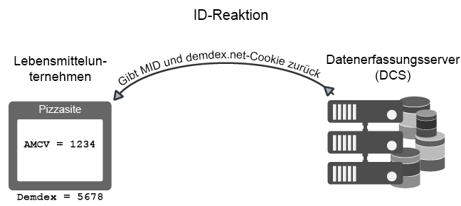
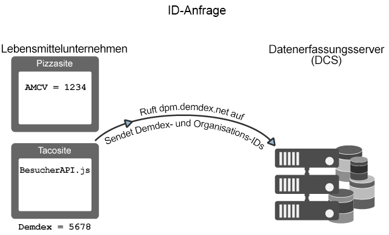
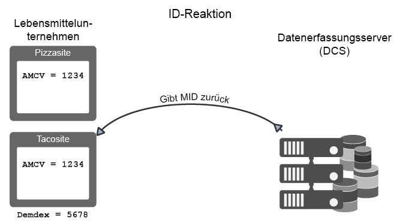
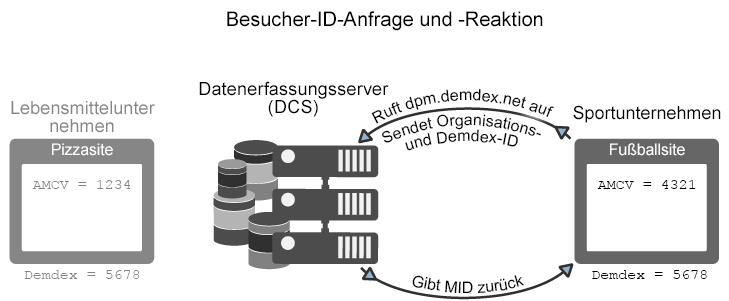

# Anfordern und Festlegen von IDs durch den Besucher-ID-Service von Adobe{#how-the-experience-cloud-id-service-requests-and-sets-ids}

Eine Übersicht über den ID-Anforderungs- und -Antwortprozess. Diese Beispiele decken die ID-Zuweisung auf einzelnen Sites, an verschiedenen Sites und für Sites ab, die von verschiedenen CX Enterprise-Kunden mit eigenen IMS-Organisations-IDs verwaltet werden.

>[!NOTE]
>
>Wenn Sie nicht genau wissen, wie der Besucher-ID-Dienst die Besucher-ID erstellt, lesen Sie „Cookies [&#x200B; der Besucher-ID-Dienst](../introduction/cookies.md).

## Anfordern einer ECID {#section-0b5e261fbd0547d9b9a1680e5ce536cc}

Die folgenden Beispiele zeigen, wie der Besucher-ID-Service die ECID anfordert und empfängt. Es wird anhand zweier fiktiver Unternehmen, „Food Company“ und „Sports Company“, erklärt, wie die Datenflüsse für ID-Anforderungen und -Antworten funktionieren. Jedes Unternehmen verfügt über eine eindeutige IMS-Organisations-ID und hat den Visitor ID Service Code auf allen seinen Sites implementiert. Diese Anwendungsfälle stellen Datenflüsse für eine allgemeine Implementierung des Besucher-ID-Service ohne Analytics, Legacy-IDs oder Browser dar, die Drittanbieter-Cookies blockieren.

**Erste Anfrage**

In diesem Beispiel kommt ein neuer Besucher zur Pizza-Site, die von der Food Company verwaltet wird. Die Food Company hat auf der Pizza-Website einen Besucher-ID-Service-Code. Wenn die Site geladen wird, prüft der Besucher-ID-Dienst-Code das AMCV-Cookie in der Pizzadomäne.

* Ist das AMCV-Cookie gesetzt, verfügt der Site-Besucher über eine ECID. In diesem Fall verfolgt das Cookie den Besucher und gibt Daten an andere CX Enterprise-Lösungen weiter.
* Wenn das AMCV-Cookie nicht gesetzt ist, ruft der Besucher-ID-Dienst-Code einen regionalen [Datenerfassungsserver](https://experienceleague.adobe.com/docs/analytics/technotes/rdc/regional-data-collection.html?lang=de) (DCS) unter `dpm.demdex.net/id` auf (siehe auch [Aufrufe an die Domain „demdex.net“](https://experienceleague.adobe.com/docs/audience-manager/user-guide/reference/demdex-calls.html?lang=de). Der Aufruf enthält die IMS-Organisations-ID für die Food Company. Die IMS-Organisations-ID wird in der `Visitor.getInstance` des Besucher-ID-Dienst-Codes festgelegt.

**Erste Antwort**

In der Antwort gibt der DCS die ECID und das demdex-Cookie zurück. Der Besucher-ID-Dienst-Code schreibt den MID-Wert in das AMCV-Cookie. Wenn der DES beispielswiese einen MID-Wert von 1234 zurückgibt, würde dieser als `mid|1234` im AMCV-Cookie gespeichert und in der Erstanbieter-Pizzadomäne gesetzt werden. Das demdex-Cookie enthält auch eine eindeutige ID (nennen wir sie 5678). Dieses Cookie wird in der Drittanbieterdomäne „demdex.net“ gesetzt, die von der Pizzadomäne verschieden ist.

Wie Sie im nächsten Beispiel sehen werden, ermöglicht die demdex-ID und die IMS-Organisations-ID dem Besucher-ID-Service, die richtige MID zu erstellen und zurückzugeben, wenn unser Besucher zu einer anderen Site wechselt, die zur Food Company gehört.

## Site-übergreifende Anforderung und Antwort {#section-15ea880453af467abd2874b8b4ed6ee9}

In diesem Beispiel navigiert der Besucher der Food Company von der Pizza-Site zur Taco-Site. Die Food Company hat auf der Taco-Website einen Besucher-ID-Service-Code. Der Besucher war noch nie auf der Taco-Website.

Unter diesen Bedingungen gibt es auf der Taco-Site kein AMCV-Cookie. Außerdem kann der Besucher-ID-Dienst das auf der Pizzaseite festgelegte AMCV-Cookie nicht verwenden, da es spezifisch für die Pizzadomäne ist. Daher muss der Besucher-ID-Service den DCS aufrufen, um eine Besucher-ID zu suchen und anzufordern. In diesem Fall enthält der DCS-Aufruf die IMS-Organisations-ID (*)* Food Company und die demdex-ID. Denken Sie daran, dass die demdex-ID von der Pizza-Site abgerufen und als Drittanbieter-Cookie unter der Domain „demdex.net“ gespeichert wird.

Nachdem der DCS die IMS-Organisations-ID und die demdex-ID erhalten hat, wird die richtige MID für den Site-Besucher erstellt und zurückgegeben. Da die mathematisch anhand der IMS-Organisations-ID und der demdex-ID ermittelt wird, enthält das AMCV-Cookie den MID-Wert `mid = 1234`.

## ID-Anforderungen von anderen Sites {#section-ba9a929e50d64b0aba080630fd83b6f1}

In diesem Beispiel verlässt der Besucher die Sites der Food Company und navigiert zur Fußball-Site, die der Sports Company gehört. Wenn der Besucher die Fußball-Site besucht, funktionieren die ID-Überprüfung und der Anforderungsprozess auf die gleiche Weise wie in den vorherigen Beispielen beschrieben. Da die Sports Company jedoch über eine eigene IMS-Organisations-ID verfügt, gibt der Besucher-ID-Service eine andere MID zurück. Die neue MID ist nur für die Domains verfügbar, die von der Sports Company kontrolliert werden, und ermöglicht es Unternehmen, Besucherdaten über Lösungen in CX Enterprise zu verfolgen und freizugeben. Die demdex-ID bleibt für den Besucher gleich, da sie in einem Drittanbieter-Cookie enthalten ist und domänenübergreifend fortbesteht.

