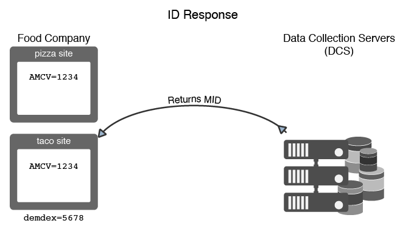

# Anfordern und Festlegen von IDs durch den Experience Cloud Identity-Dienst {#how-the-experience-cloud-id-service-requests-and-sets-ids}

Eine Übersicht über den ID-Anforderungs- und -Antwortprozess. Diese Beispiele decken die ID-Zuweisung auf individuellen Sites, Site-übergreifend und für durch verschiedene Experience Cloud-Kunden verwaltete Sites mit eigenen Kunden-IDs ab.

>[!NOTE]
>
>Wenn Sie nicht genau wissen, wie der Experience Cloud Identity-Dienst die Besucher-ID erstellt, lesen Sie in [Experience Cloud](../introduction/cookies.md) nach.

**Tipp:** Siehe auch unser [ID-Dienst-Video zum domänenübergreifenden Tracking](https://helpx.adobe.com/de/marketing-cloud-core/kb/MCID/CrossDomain.html).

## Anfordern einer Experience Cloud ID {#section-0b5e261fbd0547d9b9a1680e5ce536cc}

In den folgenden Beispielen wird dargestellt, wie der ID-Dienst die Experience Cloud-Besucher-ID anfordert und erhält. Es wird anhand zweier fiktiver Unternehmen, „Food Company“ und „Sports Company“, erklärt, wie die Datenflüsse für ID-Anforderungen und -Antworten funktionieren. Jede Firma verfügt über eine eindeutige Experience Cloud-Organisations-ID und hat den ID-Dienst-Code auf allen ihren Sites implementiert. In diesen Anwendungsfällen werden die Datenströme für eine allgemeine ID-Dienstimplementierung ohne Analytics, Legacy-IDs oder Drittanbieter-Cookies blockierende Browser dargestellt.

**Erste Anfrage**

In diesem Beispiel kommt ein neuer Besucher zur Pizza-Site, die von der Food Company verwaltet wird. Die Food Company hat auf der Pizza-Site ID-Dienst-Code implementiert. Beim Laden der Site wird vom ID-Dienst-Code der AMCV-Cookie in der Pizzadomäne gesucht.

* Ist der AMCV-Cookie gesetzt, verfügt der Site-Besucher über eine Experience Cloud ID. In diesem Fall verfolgt das Cookie den Besucher und teilt Daten mit anderen Experience Cloud-Lösungen.
* Wenn das AMCV-Cookie nicht gesetzt ist, ruft der ID-Dienst-Code einen regionalen [Datenerfassungsserver](https://docs.adobe.com/content/help/de-DE/analytics/technotes/rdc/regional-data-collection.html) (DCS) unter `dpm.demdex.net/id` auf (siehe auch [Aufrufe an die Domäne „demdex.net“](https://docs.adobe.com/content/help/de-DE/audience-manager/user-guide/reference/demdex-calls.html)). Im Aufruf enthalten ist auch die Organisations-ID der Food Company. Die Organisations-ID wird in der Funktion `Visitor.getInstance` des ID-Dienst-Codes festgelegt.

**Erste Antwort**

In der Antwort gibt der DES die [!DNL Experience Cloud] ID (MID) und den demdex-Cookie zurück. Der ID-Dienst-Code schreibt den MID-Wert in das AMCV-Cookie. Wenn der DES beispielswiese einen MID-Wert von 1234 zurückgibt, würde dieser als `mid|1234` im AMCV-Cookie gespeichert und in der Erstanbieter-Pizzadomäne gesetzt werden. Das demdex-Cookie enthält auch eine eindeutige ID (nennen wir sie 5678). Dieses Cookie wird in der Drittanbieterdomäne „demdex.net“ gesetzt, die von der Pizzadomäne verschieden ist.

Wie Sie im nächsten Beispiel sehen werden, ermöglichen die demdex-ID und die Organisations-ID dem ID-Dienst, die richtige MID zu erstellen und zurückzugeben, wenn unser Besucher zu einer anderen Site wechselt, die zur Food Company gehört.

## Site-übergreifende Anforderung und Antwort {#section-15ea880453af467abd2874b8b4ed6ee9}

In diesem Beispiel navigiert der Besucher der Food Company von der Pizza-Site zur Taco-Site. Die Food Company hat auf der Taco-Site ID-Dienst-Code implementiert. Der Besucher war noch nie auf der Tacos-Website.

Unter diesen Bedingungen gibt es auf der Tacos-Site kein AMCV-Cookie. Der ID-Dienst kann das auf der Pizza-Site festgelegte AMCV-Cookie nicht verwenden, da es spezifisch für die Pizzadomäne ist. Daher muss der ID-Dienst den DCS aufrufen, um eine Besucher-ID zu suchen und anzufordern. In diesem Fall enthält der DCS-Aufruf die Organisations-ID der Food Company *und* die demdex-ID. Denken Sie daran, dass die demdex-ID von der Pizza-Site abgerufen und als Drittanbieter-Cookie unter der Domäne „demdex.net“ gespeichert wird.

Nachdem der DCS die Organisations-ID und die demdex-ID erhalten hat, wird die korrekte MID für unseren Site-Besucher erstellt und zurückgegeben. Da die mathematisch anhand der Organisations-ID und der demdex-ID ermittelt wird, enthält der AMCV-Cookie den MID-Wert `mid = 1234`.

## ID-Anforderungen von anderen Sites {#section-ba9a929e50d64b0aba080630fd83b6f1}

In diesem Beispiel verlässt der Besucher die Sites der Food Company und navigiert zur Fußball-Site, die der Sports Company gehört. Wenn der Besucher die Fußball-Site besucht, funktionieren die ID-Überprüfung und der Anforderungsprozess auf die gleiche Weise wie in den vorherigen Beispielen beschrieben. Da die Sports Company jedoch über eine eigene Organisations-ID verfügt, gibt der ID-Dienst eine andere MID zurück. Die neue MID ist für die von der Sports Company verwalteten Domänen eindeutig und ermöglicht es dem Unternehmen, Besucherdaten zu verfolgen und lösungsübergreifend in der [!DNL Experience Cloud] freizugeben. Die demdex-ID bleibt für den Besucher gleich, da sie in einem Drittanbieter-Cookie enthalten ist und domänenübergreifend fortbesteht.

