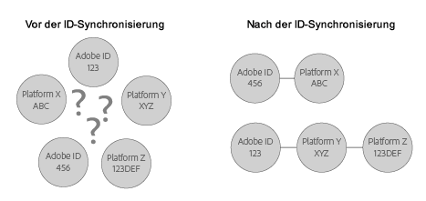

# Grundlegendes zu ID-Synchronisierung und Übereinstimmungsraten {#understanding-id-synchronization-and-match-rates}

Eine Übersicht über die ID-Synchronisierungsprozesse und Übereinstimmungsraten im Experience Cloud Identity-Dienst, einschließlich Adobe Media Optimizer und ID-Dienst.

## ID-Synchronisierung und Übereinstimmungsraten {#section-f652aae7234945e89d26dd833c5215fb}

Bei der ID-Synchronisierung werden durch den ID-Dienst zugewiesene IDs mit von unseren Kunden zu Sitebesuchern zugewiesenen IDs abgeglichen. Angenommen, der ID-Dienst hat eine Besucher-ID „1234“ zugewiesen. Eine andere Plattform kennt diesen Besucher unter der ID „4321“. Der ID-Dienst ordnet diese IDs während des Synchronisierungsprozesses zusammen zu. Die Ergebnisse erweitern das Wissen unseren Kunden über ihre Site-Besucher mit neuen Datenpunkten. Wenn der ID-Dienst eine ID nicht zuordnen kann, wird eine neue ID erstellt und diese ID für die künftige Synchronisierung verwendet.

Messen Sie Übereinstimmungsraten und überprüfen Sie die Effektivität des ID-Synchronisierungsprozesses. Hohe Übereinstimmungsraten deuten darauf hin, dass ein bestimmter Dienst effektiver ist und Zugang zu einer größeren Online-Zielgruppe bietet als ein Dienst mit niedrigen Übereinstimmungsraten. Der Vergleich von Übereinstimmungsraten ist eine quantifizierbare Methode zur Bewertung verschiedener integrierter Anzeigentechnologieplattformen.

**Gewährleisten hoher Übereinstimmungsraten**

Zum Generieren hoher Übereinstimmungsraten ist es wichtig, den ID-Dienst ordnungsgemäß einzurichten (siehe [Standard-Implementierungshandbuch](../implementation-guides/standard.md#concept-89cd0199a9634fc48644f2d61e3d2445)). Eine ordnungsgemäße Implementierung trägt dazu bei, hohe Übereinstimmungsraten sicherzustellen, da der ID-Dienst die Cookies setzen kann, die zum Arbeiten mit und Synchronisieren von IDs mit aktivierten Datenpartnern erforderlich sind. Faktoren wie langsame Internetverbindungen, die Datenerfassung von Mobilgeräten oder drahtlosen Netzwerken können sich jedoch auf die Qualität der Erfassung, Synchronisierung und des Abgleichs von IDs durch den ID-Dienst auswirken. Diese clientseitigen Variablen werden weder durch den ID-Dienst noch von [!DNL Adobe] gesteuert.

## Beschriebener ID-Synchronisierungsprozess {#section-a541a85cbbc74f5682824b1a2ee2a657}

Der ID-Dienst synchronisiert IDs in Echtzeit. Dieser Prozess funktioniert im Browser und nicht über eine Server-zu-Server-Datenübertragung. In der folgenden Tabelle werden die Schritte im ID-Synchronisierungsprozess beschrieben.

**Schritt 1: Seite laden**

Wenn ein Besucher auf Ihre Site kommt und eine Seite lädt, führt die Funktion `Visitor.getInstance` einen [CORS](../reference/cors.md#concept-6c280446990d46d88ba9da15d2dcc758)- oder JSON-P-Aufruf an den ID-Dienst durch. Der ID-Dienst antwortet mit einem Cookie, der die [!DNL Experience Cloud] ID (MID) des Besuchers enthält. Bei der MID handelt es sich um eine jedem Sitebesucher zugewiesene eindeutige ID. Siehe auch  [Cookies und der Experience Cloud Identity-Dienst](../introduction/cookies.md).

**Schritt 2: iFrame laden**

Während der Seitentext geladen wird, lädt der ID-Dienst einen iFrame namens  *`Destination Publishing iFrame`*. Der [!UICONTROL Destination Publishing iFrame] wird in einer Domäne geladen, die von der übergeordneten Seite getrennt ist. Dieses Design trägt zur Gewährleistung der Seitenleistung bei und verbessert die Sicherheit, da der iFrame:

* asynchron in Bezug auf die übergeordnete Seite geladen wird. Die übergeordnete Seite kann demnach unabhängig vom [!UICONTROL Destination Publishing iFrame] geladen werden. Das Laden des iFrames und das Laden der ID-Synchronisierungspixel aus dem iFrame wirken sich nicht auf die übergeordnete Seite oder das Kundenerlebnis aus.
* so schnell wie möglich lädt. Wenn dies zu schnell ist, können Sie den iFrame nach dem Fensterladeereignis laden (nicht empfohlen). Weitere Informationen finden Sie unter [idSyncAttachIframeOnWindowLoad](../library/function-vars/idsyncattachiframeonwindowload.md#reference-b86b7112e0814a4c82c4e24c158508f4).
* verhindert, dass Code im iFrame Zugriff auf die übergeordnete Seite erhält oder diese beeinflusst.

Siehe auch [Anfordern und Festlegen von IDs durch den Experience Cloud Identity-Dienst](../introduction/id-request.md#concept-2caacebb1d244402816760e9b8bcef6a).

**Schritt 3: ID-Synchronisierungen auslösen**

Die ID-Synchronisierung ist eine URL, die im Destination Publishing iFrame ausgelöst wird. Eine URL für die ID-Synchronisierung enthält, wie in diesem generischen Beispiel gezeigt, den ID-Synchronisierungsendpunkt eines Partners und eine Umleitungs-URL, die zu [!DNL Adobe] zurückleitet und die entsprechende ID enthält.

`http://abc.com?partner_id=abc&sync_id=123&redir=http://dpm.demdex.net/ibs:dpid=<ADOBE_PARTNER_ID>&dpuuid=<PARTNER_UUID>`

Siehe auch [ID-Synchronisierung für eingehende Datenübertragungen](https://experienceleague.adobe.com/docs/audience-manager/user-guide/implementation-integration-guides/sending-audience-data/batch-data-transfer-process/id-sync-http.html?lang=en).

**Schritt 4: IDs speichern**

Synchronisierte IDs werden auf den [Edge- und Core-Daten-Servern gespeichert](https://experienceleague.adobe.com/docs/audience-manager/user-guide/reference/system-components/components-edge.html?lang=en).

## Synchronisierungsdienste verwalten die ID-Synchronisierung {#section-cd5784d7ad404a24aa28ad4816a0119a}

Der Begriff *`Sync Services`* bezieht sich auf interne [!DNL Experience Cloud]-Technologien, die für die ID-Synchronisation verantwortlich sind. Dieser Dienst ist standardmäßig aktiviert. Um ihn zu deaktivieren, müssen Sie eine  [optionale Variable](../library/function-vars/disableidsync.md#reference-589d6b489ac64eddb5a7ff758945e414) zur ID-Dienstfunktion `Visitor.getInstance` hinzufügen. Die Synchronisierungsdienste gleichen unterschiedliche [!DNL Experience Cloud]-IDs ab, beispielsweise:

* [!DNL Experience Cloud]-Cookie-IDs von Drittanbietern mit [!DNL Experience Cloud]-IDs von Erstanbietern.

* [!DNL Experience Cloud]-Cookie-IDs von Erstanbietern mit [!DNL Adobe Media Optimizer]-IDs (AMO).

* [!DNL Experience Cloud]-Cookie-IDs von Drittanbietern mit Drittdatenanbieter- und Targeting Platform-IDs. Dies umfasst Dienste und Plattformen wie Datenanbieter, bedarfsgesteuerte bzw. anbieterseitige Plattformen, Werbenetzwerke, Austausche usw.
* [!DNL Experience Cloud]-Cookie-IDs von Erstanbietern mit geräteübergreifenden Partner-IDs.

## ID-Synchronisierung mit Adobe Advertising Cloud {#section-642c885ea65d45ffb761f78838735016}

[!DNL Adobe Advertising Cloud] (früher [!DNL Adobe Media Optimizer]genannt) bildet eine Ausnahme zum iFrame-basierten ID-Synchronisierungsprozess. Da es sich bei [!DNL Advertising Cloud] um eine vertrauenswürdige Domäne handelt, erfolgt die ID-Synchronisierung von der übergeordneten Seite aus statt im [!UICONTROL Destination Publishing iFrame]. Bei der Synchronisierung ruft der ID-Dienst [!DNL Advertising Cloud] unter `cm.eversttech.net` dem älteren Domänennamen auf, der von [!DNL Advertising Cloud] vor der Akquise durch Adobe verwendet wurde. Das Senden von Daten an [!DNL Advertising Cloud] kann Übereinstimmungsraten verbessern und wird für Kunden mit Version 2.0 des ID-Diensts (oder höher) automatisch durchgeführt. Siehe auch [Advertising Cloud-Cookies](https://experienceleague.adobe.com/docs/core-services/interface/administration/ec-cookies/cookies-advertising-cloud.html?lang=en).

>[!MORELIKETHIS]
>
>* [Aufrufe an die Domäne „demdex.net“ ](https://experienceleague.adobe.com/docs/audience-manager/user-guide/reference/demdex-calls.html?lang=en)

