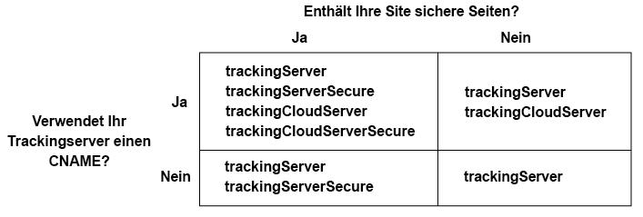

# Implementieren des Experience Cloud ID-Diensts für Analytics {#implement-the-experience-cloud-id-service-for-analytics}

Diese Anweisungen richten sich an Analytics-Kunden, die den Experience Cloud ID-Dienst verwenden möchten, nicht aber das Dynamic Tag Management (DTM). Es wird jedoch dringend empfohlen, DTM zum Implementieren des ID-Diensts zu verwenden. DTM optimiert die Implementierung des Workflows und gewährleistet automatisch die richtige Codeplatzierung und -abfolge.

>[!IMPORTANT]
>
>* [Lesen Sie sich die Anforderungen durch,](../mcvid-reference/mcvid-requirements.md) bevor Sie beginnen.
>* Konfigurieren und testen Sie den Code in einer Entwicklungsumgebung, bevor er in das Produktivsystem übernommen wird.
>


Führen Sie folgende Schritte aus, um den ID-Dienst für Adobe Analytics zu implementieren:

1. [Herunterladen des ID-Dienst-Codes](../mcvid-implementation-guides/mcvid-setup-analytics.md#section-ead9403a6b7e45b887f9ac959ef89f7f)
1. [Fügen Sie die Funktion Visitor. getinstance dem ID-Dienst-Code hinzu.](../mcvid-implementation-guides/mcvid-setup-analytics.md#section-6053a6b7c16c466a9f9fdbf9cb9db3df)
1. [Fügen Sie Visitor. getinstance Ihre Experience Cloud-Organisations-ID hinzu.](../mcvid-implementation-guides/mcvid-setup-analytics.md#section-7b8a6e76dc124d0e9ab1ce96ab2ffb0e)
1. [Hinzufügen Ihrer Tracking-Server zu Visitor. getinstance](../mcvid-implementation-guides/mcvid-setup-analytics.md#section-70ec9ebff47940d8ab520be5ec4728c5)
1. [Datei appmeasurement. js oder s_ code. js aktualisieren](../mcvid-implementation-guides/mcvid-setup-analytics.md#section-b53113aea1bd4de896e0e4e9a7edee19)
1. [Hinzufügen des Besucher-API-Codes zur Seite](../mcvid-implementation-guides/mcvid-setup-analytics.md#section-d46d6aa324c842f2931d901e38d6db1d)
1. [(Optional) Konfigurieren einer Übergangsphase](../mcvid-implementation-guides/mcvid-setup-analytics.md#section-7bbb2f72c26e4abeb8881e18366797a3)
1. [Testen und Bereitstellen des ID-Dienst-Codes](../mcvid-implementation-guides/mcvid-setup-analytics.md#section-e9c1764ac21a4ec5be1ff338c0e2e01b)

## Schritt 1: Herunterladen des ID-Dienst-Codes {#section-ead9403a6b7e45b887f9ac959ef89f7f}

Für den Code [!DNL ID Service] ist die `VisitorAPI.js` Codebibliothek erforderlich. Zum Herunterladen dieser Code-Bibliothek tun Sie Folgendes:

1. Wechseln Sie zu **[!UICONTROL Admin]** &gt; **[!UICONTROL Code-Manager]**.
1. Klicken Sie in [!DNL Code Manager]auf **[!UICONTROL javascript (Neu)]** oder **[!UICONTROL javascript (Legacy)]**.

   Dies leitet das Herunterladen der komprimierten Code-Bibliotheken ein.

1. Entpacken Sie die Code-Datei und öffnen Sie die Datei `VisitorAPI.js`.

## Schritt 2: Fügen Sie die Funktion Visitor. getinstance dem ID-Dienst-Code hinzu. {#section-6053a6b7c16c466a9f9fdbf9cb9db3df}

>[!IMPORTANT]
>
>* In älteren Versionen der ID-Dienst-API wurde diese Funktion an einem anderen Ort platziert, und es war eine andere Syntax erforderlich. Sollten Sie von einer Version migrieren, die älter ist als [Version 1.4](../mcvid-release-notes/mcvid-notes-2015.md#section-f5c596f355b14da28f45c798df513572), beachten Sie die hier beschriebene neue Platzierung und Syntax.
>* Code in Großbuchstaben ist ein Platzhalter für die tatsächlichen Werte. Ersetzen Sie diesen Text durch Ihre Organisations-ID, Ihre Tracking-Server-URL oder einen anderen benannten Wert.
>


**Teil 1: Kopieren Sie die unten stehende Funktion Visitor.getInstance**

```js
var visitor = Visitor.getInstance("INSERT-MARKETING-CLOUD-ORGANIZATION-ID-HERE", { 
     trackingServer: "INSERT-TRACKING-SERVER-HERE", // same as s.trackingServer 
     trackingServerSecure: "INSERT-SECURE-TRACKING-SERVER-HERE", // same as s.trackingServerSecure 
 
     // To enable CNAME support, add the following configuration variables 
     // If you are not using CNAME, DO NOT include these variables 
     marketingCloudServer: "INSERT-TRACKING-SERVER-HERE", 
     marketingCloudServerSecure: "INSERT-SECURE-TRACKING-SERVER-HERE" // same as s.trackingServerSecure 
}); 
```

**Teil 2: Fügen Sie der Datei VistorAPI.js Funktions-Code hinzu**

Platzieren Sie die Funktion `Visitor.getInstance` am Ende der Datei nach dem Code-Block. Die bearbeitete Datei sollte wie folgt aussehen:

```js
/* 
========== DO NOT ALTER ANYTHING BELOW THIS LINE ========== 
Version and copyright section 
*/ 
 
// Visitor API code library section 
 
// Put Visitor.getInstance at the end of the file, after the code library

var visitor = Visitor.getInstance("INSERT-MARKETING-CLOUD-ORGANIZATION-ID-HERE", { 
     trackingServer: "INSERT-TRACKING-SERVER-HERE", // same as s.trackingServer 
     trackingServerSecure: "INSERT-SECURE-TRACKING-SERVER-HERE", // same as s.trackingServerSecure 
 
     // To enable CNAME support, add the following configuration variables 
     // If you are not using CNAME, DO NOT include these variables 
     marketingCloudServer: "INSERT-TRACKING-SERVER-HERE", 
     marketingCloudServerSecure: "INSERT-SECURE-TRACKING-SERVER-HERE" // same as s.trackingServerSecure 
}); 
```

## Schritt 3: Fügen Sie Visitor. getinstance Ihre Experience Cloud-Organisations-ID hinzu. {#section-7b8a6e76dc124d0e9ab1ce96ab2ffb0e}

Ersetzen Sie in der `Visitor.getInstance` Funktion die `INSERT-MARKETING-CLOUD-ORGANIZATION ID-HERE` ID Ihres [!DNL Experience Cloud] Unternehmens. Sollten Sie Ihre Organisations-ID nicht kennen, finden Sie diese auf der Administrationsseite der [!DNL Experience Cloud]. Siehe auch [Administration – Kerndienste.](https://marketing.adobe.com/resources/help/en_US/mcloud/admin_getting_started.html) Die bearbeitete Funktion sollte dem unten stehenden Beispiel ähnlich sehen.

`var visitor = Visitor.getInstance("1234567ABC@AdobeOrg", { ...`

>[!IMPORTANT]
>
>*Ändern Sie nicht* den Fall der Zeichen in Ihrer Organisations-ID. Bei der ID wird Groß- und Kleinschreibung beachtet und sie muss so eingegeben werden, wie sie von Adobe angegeben wird.

## Schritt 4: Hinzufügen Ihrer Tracking-Server zu Visitor. getinstance {#section-70ec9ebff47940d8ab520be5ec4728c5}

Tracking-Server werden für die Datenerfassung in [!DNL Analytics] verwendet.

**Teil 1: Ermitteln der Tracking-Server-URLs**

Überprüfen Sie Ihre `s_code.js` Dateien `AppMeasurement.js` , um die Tracking-Server-urls zu finden. Die URLs werden von folgenden Variablen spezifiziert:

* `s.trackingServer`
* `s.trackingServerSecure`

**Teil 2: Festlegen der Tracking-Server-Variablen**

Zur Festlegung, welche Tracking-Server-Variablen verwendet werden sollen:

1. Beantworten Sie die Fragen in der unten stehenden Entscheidungsmatrix. Verwenden Sie die Variablen, die Ihren Antworten entsprechen.
1. Ersetzen Sie die Tracking-Server-Platzhalter durch Ihre eigenen Tracking-Server-URLs.
1. Entfernen Sie nicht verwendete Tracking-Server- und [!DNL Experience Cloud]-Servervariablen aus dem Code.



>[!NOTE]
>
>Passen Sie bei Verwendung den [!DNL Experience Cloud] Server-urls den entsprechenden Tracking-Server-urls wie folgt an: &gt;
>* [!DNL Experience Cloud] server URL = Tracking Server URL
>* [!DNL Experience Cloud] server sichere URL = Tracking server sichere URL
>


Wenn Sie nicht sicher sind, wie Sie den Tracking-Server finden, lesen Sie [die Variablen FAQ](../mcvid-faq-intro/ecid-faq.md) und [Korrektes Füllen der Variablen trackingserver und trackingserversecure](https://helpx.adobe.com/analytics/kb/determining-data-center.html#).

## Schritt 5: Datei appmeasurement. js oder s_ code. js aktualisieren {#section-b53113aea1bd4de896e0e4e9a7edee19}

Fügen Sie diese Funktion Ihrer `AppMeasurement.js` oder `s_code.js` Ihrer Datei hinzu:

`s.visitor = Visitor.getInstance("INSERT-MARKETING-CLOUD-ORGANIZATION ID-HERE");`

Fügen Sie den Code in denselben Abschnitt ein, der Konfigurationen wie `linkInternalFilters`, `charSet``trackDownloads`usw. enthält.

***(Optional, jedoch empfohlen)*Erstellung einer benutzerspezifischen Eigenschaft**

Legen Sie eine benutzerdefinierte Eigenschaft in `AppMeasurement.js` oder `s_code.js` zur Messung der Abdeckung fest. Fügen Sie der `doPlugins` Funktion Ihrer `AppMeasurement.js` oder `s_code.js` Dateien diese benutzerdefinierte Eigenschaft hinzu:

```js
// prop1 is used as an example only. Choose any available prop. 
s.prop1 = (typeof(Visitor) != "undefined" ? "VisitorAPI Present" : "VisitorAPI Missing");
```

## Schritt 6: Hinzufügen des Besucher-API-Codes zur Seite {#section-d46d6aa324c842f2931d901e38d6db1d}

Platzieren Sie die `VisitorAPI.js` Datei in den `<head>` Tags auf jeder Seite. Wenn Sie die Datei `VisitorAPI.js` zu Ihrer Seite hinzufügen:

* Platzieren Sie es am Anfang des `<head>` Abschnitts, damit er vor anderen Lösungstags angezeigt wird.
* Sie muss vor AppMeasurement und dem Code für andere [!DNL Experience Cloud]-Lösungen ausgeführt werden.

Versetzen Sie diesen Code nach dem Testen und Überprüfen in die Produktionsumgebung.

## Schritt 7: (Optional) Konfigurieren einer Übergangsphase {#section-7bbb2f72c26e4abeb8881e18366797a3}

Wenden Sie sich bei einem dieser Anwendungsfälle an die [Kundenunterstützung](https://helpx.adobe.com/marketing-cloud/contact-support.html) , um eine vorübergehende [Übergangsphase](../mcvid-reference/mcvid-analytics-reference/mcvid-grace-period.md)einzurichten. Übergangsphasen können bis zu 180 Tage dauern. Falls erforderlich, kann eine Übergangsphase auch erneuert werden.

**Partielle Implementierung**

Sie benötigen eine Übergangsphase, wenn Sie einige Seiten verwalten, die den ID-Dienst verwenden, und einige Seiten, die diesen nicht verwenden, die jedoch alle in der gleichen [!DNL Analytics] Report Suite aufgeführt sind. Dies ist oft bei Kunden der Fall, die über eine globale, domänenübergreifende Report Suite verfügen.

Nach Bereitstellung des ID-Diensts für alle Webseiten, die in der gleichen Suite aufgeführt sind, kann die Übergangsphase abgebrochen werden.

**Voraussetzungen für den s_vi-Cookie**

Sie müssen eine Übergangsphase einrichten, wenn für neue Besucher nach Migration zum ID-Dienst ein s_vi-Cookie erforderlich ist. Dies ist oft der Fall, wenn Ihre Implementierung den s_vi-Cookie liest und ihn in einer Variablen speichert.

Sobald Ihre Implementierung statt Lesen des s_vi-Cookies die MID erhält, kann die Übergangsphase abgebrochen werden.

Detaillierte Informationen zur Erfassung von Lebenszyklusmetriken in Ihrer mobilen Anwendung finden Sie unter [Cookies und der Experience Cloud ID-Dienst](../mcvid-introduction/mcvid-cookies.md).

Sie müssen eine Übergangsphase konfigurieren, wenn Sie Daten von einem Clickstream-Datenfeed an ein internes System senden und bei der Verarbeitung die Spalten `visid_high` und `visid_low` verwendet werden.

Sobald der Datenerfassungsprozess die Spalten `post_visid_high` und `post_visid_low` Spalten verwenden kann, können Sie die Übergangsphase abbrechen.

Siehe [Clickstream-Datenspaltenbezug](https://marketing.adobe.com/resources/help/en_US/sc/clickstream/datafeeds_reference.html).

**Clickstream-Datenverarbeitung**

## Schritt 8: Testen und Bereitstellen des ID-Dienst-Codes {#section-e9c1764ac21a4ec5be1ff338c0e2e01b}

Sie können wie folgt testen und bereitstellen.

**Testen und überprüfen**

Prüfen Sie zum Testen Ihrer ID-Dienstimplementierung Folgendes:

* [AMCV-Cookie](../mcvid-introduction/mcvid-cookies.md) in der Domäne, in der Ihre Seite gehostet wird.
* MID-Wert in der [!DNL Analytics]-Bildanfrage mit dem [Adobe Debugger-Werkzeug](https://marketing.adobe.com/resources/help/en_US/sc/implement/debugger.html).

Siehe [Testen und Überprüfen des Experience Cloud ID-Diensts](../mcvid-implementation-guides/mcvid-test-verify.md).

**Code bereitstellen**

Stellen Sie den Code nach bestandenen Tests bereit.

Sollten Sie in [Schritt 7](../mcvid-implementation-guides/mcvid-setup-analytics.md#section-7bbb2f72c26e4abeb8881e18366797a3) einen Übergangszeitraum konfiguriert haben:

* Stellen Sie sicher, dass die [!DNL Analytics]-ID (AID) und die MID sich in der Bildabfrage befinden.
* Denken Sie daran, die Übergangsphase nach Erfüllung der Kriterien für eine Beendigung der Verwendung abzubrechen.
