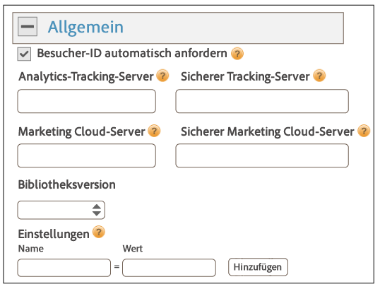
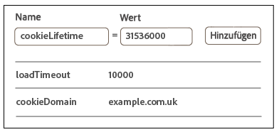
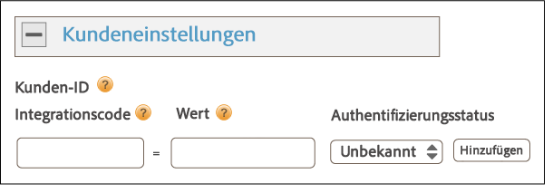
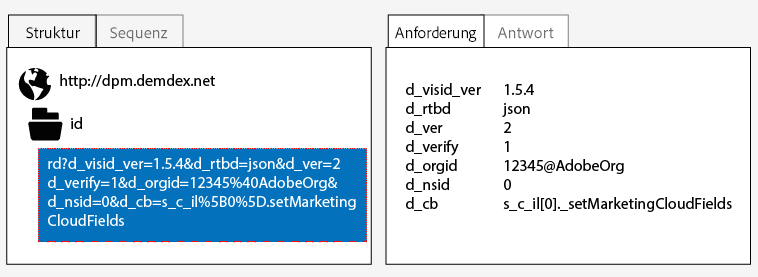
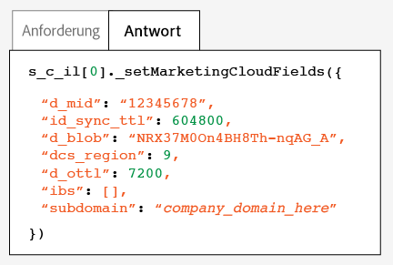
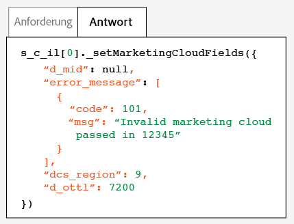

# Implementierung mit dynamischem Tag-Management{#implementation-with-dynamic-tag-management}

In älteren Implementierungen wird das Dynamic Tag Management (DTM) zur Einrichtung, Bereitstellung und Integration des Experience Cloud ID-Diensts in Ihre anderen Experience Cloud-Lösungen verwendet.

## Implementierung mit dynamischem Tag-Management {#topic-6f4ed5d96977406ca991e50f3fbd5b01}

In älteren Implementierungen wird das Dynamic Tag Management (DTM) zur Einrichtung, Bereitstellung und Integration des Experience Cloud ID-Diensts in Ihre anderen Experience Cloud-Lösungen verwendet.

>[!NOTE]
>
>Derzeit ist [Launch von Adobe](https://docs.adobelaunch.com/) das bevorzugte und empfohlene Implementierungstool, da es komplexe Tag-Management-Aufgaben vereinfacht und die Codeplatzierung über die Funktionen von DTM automatisiert. Siehe [Implementieren mit Launch](../mcvid-implementation-guides/ecid-implement-with-launch.md).

## Dynamic Tag Management und der ID-Dienst {#section-4a4c4fac5d0a4cbbaff8e1833f73657c}

[Mit dem dynamischen Tag-Management](https://marketing.adobe.com/resources/help/en_US/dtm/) können Sie Ihre ID-Dienstinstanz und zugehörige [!DNL Experience Cloud] Lösungsintegrationen konfigurieren, bereitstellen und verwalten. DTM unterstützt die Vereinfachung des Implementierungsprozesses, da es hochgradig im ID-Dienst und in andere Experience Cloud-Lösungen integriert ist. Fügen Sie einfach das Experience Cloud ID-Tool hinzu, konfigurieren Sie es und geben Sie Informationen an, beispielsweise:

* Experience Cloud-Organisations-ID (wird bei der Verknüpfung mit Experience Cloud automatisch ausgefüllt)
* Analytics-Tracking-Server (sicherer und nicht sicherer)
* Experience Cloud-Server (für Tracking-Server von Erstanbietern)

DTM ist für [!DNL Experience Cloud]-Kunden kostenlos verfügbar.

**Erste Schritte mit DTM**

DTM ist ein einfaches und leistungsstarkes Tool. Falls Sie es nicht bereits verwenden, raten wir Ihnen dringend dazu. Erste Schritte zu diesem Dienst finden Sie in der DTM-[Dokumentation](https://marketing.adobe.com/resources/help/en_US/dtm/c_overview.html) und in den Videos zur [DTM-Starthilfe](https://marketing.adobe.com/resources/help/en_US/dtm/jump-start-videos.html). Anweisungen zur Einrichtung des ID-Diensts mit DTM finden Sie in den Informationen und Verfahren in den folgenden Abschnitten.

## Implementierungsrichtlinien {#concept-54a2ec49af8f4bfca9207b1d404e8e1a}

Lesen Sie diese Anforderungen und Verfahren, bevor Sie versuchen, den Experience Cloud ID-Dienst im Dynamic Tag Management (DTM) zu integrieren.

<!--
mcvid-dtm-deployment.xml
-->

**Bereitstellen Ihres Kontos**

Bevor Sie beginnen können, stellen Sie sicher, dass Ihr Unternehmen und Ihre Lösungen für den Benutzer [!DNL Experience Cloud] bereitgestellt wurden und mit Ihnen vertraut [!DNL Dyanamic Tag Management]sind. Diese Dokumentationen helfen bei den ersten Schritten:

* [Aktivierung Ihrer Lösungen für Hauptdienste](https://marketing.adobe.com/resources/help/en_US/mcloud/core_services.html): Implementieren Sie die Experience Cloud und werden Sie Administrator. Durch diesen Prozess werden Ihre Lösungen bezüglich der zentralen Dienste wie Kundenattribute und Experience Cloud-Zielgruppen modernisiert.
* [Dynamic Tag Management – Erste Schritte](https://marketing.adobe.com/resources/help/en_US/dtm/get_started.html)
* [Schnellstartvideos](https://marketing.adobe.com/resources/help/en_US/dtm/jump-start-videos.html): Eine Reihe kurzer Videos, die zeigen, wie grundlegende DTM-Aufgaben ausgeführt werden.

**Platzierung und Ladereihenfolge des ID-Dienst-Codes**

Der ID-Dienst funktioniert durch das Anfordern und Empfangen einer eindeutigen ID von den [!DNL Adobe]-Datenerfassungsservern. Für eine ordnungsgemäße Funktion muss Ihr ID-Dienstcode:

* der erste Block des [!DNL Adobe]-Codes sein, der auf der Seite ausgeführt wird.
* Wird möglichst hoch auf der Seite platziert, normalerweise innerhalb des `<head>` Codeblocks.

Solange Sie all Ihre [!DNL Adobe]-Lösungen und -Codebibliotheken in DTM aufbewahren, ist sichergestellt, dass Ihr ID-Dienstcode an der richtigen Position platziert und zur richtigen Zeit ausgelöst wird.

**Validieren der regionalen Datenerfassung**

Kunden müssen einen CNAME bereitstellen oder [!DNL *.sc.omtrdc] für [regionale Datenerfassung](https://marketing.adobe.com/resources/help/en_US/whitepapers/rdc/) (RDC) verwenden. Erfragen Sie die jeweiligen RDC-Einstellungen bei Ihrem [!DNL Adobe]-Berater.

**Analytics-Report Suites konfigurieren**

Neue [!DNL Analytics]-Kunden sollten eine [Report-Suite](https://marketing.adobe.com/resources/help/en_US/reference/new_report_suite.html) für die Datenerfassung erstellen.

## Implementieren des Experience Cloud ID-Diensts in DTM {#task-a659cf19dea84ad48edabe0b72ef9f5c}

Befolgen Sie diese Schritte, um den ID-Dienst im Dynamic Tag Management (DTM) zu implementieren.

**Voraussetzungen**

* Aktivieren Sie Ihre Lösungen für die [!DNL Experience Cloud] und stellen Sie sicher, dass Sie über Administratorberechtigungen verfügen. Siehe [Aktivieren der Lösungen für Hauptdienste](https://marketing.adobe.com/resources/help/en_US/mcloud/core_services.html).

* Erstellen Sie eine Webeigenschaft in DTM. Lesen Sie die Dokumentation zu DTM mit dem Titel [Erstellen einer Webeigenschaft](https://marketing.adobe.com/resources/help/en_US/dtm/web_property.html) oder sehen Sie sich das Video zum [Schnellstart für Administratoren](https://marketing.adobe.com/resources/help/en_US/dtm/admin-jump-start.html) an.

<!--
mcvid-dtm-implement.xml
-->

**Implementierungsschritte** zur Implementierung des ID-Diensts mit DTM:

1. Klicken Sie im DTM-[!DNL Dashboard] auf die gewünschte Webeigenschaft.
1. Klicken Sie auf der Registerkarte **[!UICONTROL Übersicht]** Ihrer ausgewählten Webeigenschaft auf Tool **[!UICONTROL hinzufügen]**.
1. Klicken Sie in der **[!UICONTROL Liste &quot;Tool-Typ]** &quot; auf **[!UICONTROL Experience Cloud ID-Dienst]**.

   >[!NOTE]
   >
   >Diese Aktion füllt das Feld **[!UICONTROL &quot;Experience Cloud-Organisations-ID]** &quot; mit Ihrer Organisations-ID. Wenn Ihr DTM-Konto nicht mit der [!DNL Experience Cloud] verknüpft ist, müssen Sie diese ID angeben. Informationen zum Verknüpfen von Konten finden Sie im Thema über das [Verknüpfen von Konten in der Experience Cloud](https://marketing.adobe.com/resources/help/en_US/mcloud/organizations.html). Informationen für die Suche nach Ihrer Organisations-ID finden Sie in den [Anforderungen](../mcvid-reference/mcvid-requirements.md#section-a02f537129a64ffbb690d5738d360c26).

1. Geben Sie den Namen Ihres Tracking-Servers in das **[!UICONTROL Feld Tracking Server]** ein. Wenn Sie nicht sicher sind, wie Sie den Tracking-Server finden, lesen Sie [die Variablen FAQ](../mcvid-faq-intro/mcvid-faq.md) und [Korrektes Füllen der Variablen trackingserver und trackingserversecure](https://helpx.adobe.com/analytics/kb/determining-data-center.html#).
1. Klicken **[!UICONTROL Sie auf Tool erstellen]** und **[!UICONTROL speichern Sie Änderungen]**.

   Nach dem Speichern wird der ID-Dienst als ein Tool in DTM eingerichtet. Er kann jedoch noch nicht verwendet werden. Ihr DTM-Tool muss zunächst den DTM-Veröffentlichungs-/Genehmigungsprozess durchlaufen. Zudem können Sie zusätzliche Parameter konfigurieren. Informationen über den DTM-Genehmigungsprozess finden Sie im Video mit der [Starthilfe zu den Benutzergrundlagen](https://marketing.adobe.com/resources/help/en_US/dtm/user-basics-jump-start.html). Informationen über die zusätzlichen Parameter, die Sie zu DTM hinzufügen können, finden Sie unter [Experience Cloud ID-Diensteinstellungen für DTM](../mcvid-implementation-guides/mcvid-standard.md#concept-fb6cb6a0e6cc4f10b92371f8671f6b59).

>[!MORE_ LIKE_ THIS]
>
>* [Webeigenschaften](https://marketing.adobe.com/resources/help/en_US/dtm/web_property.html)


## Experience Cloud ID-Diensteinstellungen für DTM {#concept-fb6cb6a0e6cc4f10b92371f8671f6b59}

Beschreibt die [!DNL Organization ID]Felder und [!DNL General][!DNL Customer Settings] Felder und deren Verwendung durch den [!DNL Experience Cloud] ID-Dienst.

<!--
mcvid-dtm-settings.xml
-->

## Wie finde ich diese Einstellungen? {#section-c5b2d1c928944ae2b8565c1b182fe575}

Die Einstellungen stehen nach dem Hinzufügen und Speichern des ID-Dienstes als ein Tool im Dynamic Tag Management (DTM) zur Verfügung. Sie können auch auf diese Einstellungen zugreifen, indem Sie im Abschnitt [!DNL Installed Tools] Ihrer DTM-Webeigenschaft auf das Zahnradsymbol klicken.


## Organisations-ID {#section-949b5a0d8af940558b04ff675cf53f77}

Dies ist die für Ihr bereitgestelltes [!DNL Experience Cloud]-Unternehmen erforderliche und mit ihm verknüpfte ID. Bei einer Organisation handelt es sich um die Entität, die einem Administrator das Konfigurieren von Benutzern und Gruppen sowie das Steuern des Single Sign-On-Zugriffs in der [!DNL Experience Cloud] ermöglicht. Die Organisations-ID besteht aus einer 24-stelligen alphanumerischen Zeichenfolge, gefolgt von (dem obligatorischen) @AdobeOrg. [!DNL Experience Cloud]-Administratoren können diese ID unter [Experience Cloud &gt; Tools](https://marketing.adobe.com/resources/help/en_US/mcloud/admin_getting_started.html) finden.


Siehe auch [Cookies und Experience Cloud ID-Dienst](../mcvid-introduction/mcvid-cookies.md).

## Allgemeine Einstellungen {#section-071d358e40f84629a8901b893dd61392}

Mit diesen Einstellungen können Sie Tracking-Server angeben, Versionen codieren und andere Variablen hinzufügen.



In der folgenden Tabelle sind [!DNL General] die Einstellungen aufgeführt und definiert.

**Besucher-ID automatisch anfordern**

Wenn das dynamische Tag-Management aktiviert ist, ruft es automatisch die `getMarketingCloudVisitorID()` Methode auf, bevor eine der Adobe-Lösungen geladen wird, die den Experience Cloud ID-Dienst verwenden.

Siehe [getmarketingcloudvisitorid](../mcvid-library/mcvid-get-set/mcvid-getmcvid.md).

**Analytics-Tracking-Server**

Der Name des für die Analysedatenerfassung verwendeten Tracking-Servers. Dies ist die Domäne, auf der die Bildanforderung und das Cookie geschrieben werden (z. B. [!DNL http://site.omtrdc.net]).

Wenn Sie Ihre Tracking-Server-urls nicht kennen, überprüfen Sie Ihre `s_code.js` Dateien `AppMeasurement.js` . Sie möchten, dass die URL durch die Variable `s.trackingServer` festgelegt wird.

Siehe [trackingServer](https://marketing.adobe.com/resources/help/en_US/sc/implement/trackingServer.html) und [Korrektes Füllen der Variablen „trackingServer“ und „trackingServerSecure“](https://helpx.adobe.com/analytics/kb/determining-data-center.html#).

**Sicherer Tracking-Server**

Der Name des für die Analysedatenerfassung verwendeten sicheren Tracking-Servers. Dies ist die Domäne, auf der die Bildanforderung und das Cookie geschrieben werden (z. B. [!DNL https://site.omtrdc.net]).

Wenn Sie Ihre Tracking-Server-urls nicht kennen, überprüfen Sie Ihre `s_code.js` Dateien `AppMeasurement.js` . Sie möchten, dass die URL durch die Variable `s.trackingServerSecure` festgelegt wird.

Siehe [trackingServer](https://marketing.adobe.com/resources/help/en_US/sc/implement/trackingServer.html) und [Korrektes Füllen der Variablen „trackingServer“ und „trackingServerSecure“](https://helpx.adobe.com/analytics/kb/determining-data-center.html#).

**Experience Cloud-Server**

Wenn Ihr Unternehmen die Erstanbieter-Datenerfassung (CNAME) nutzt, um Erstanbieter-Cookies in einem Drittanbieter-Kontext zu verwenden, geben Sie hier den Tracking-Server ein (z. B. [!DNL http://metrics.company.com]).

**Sicherer Experience Cloud-Server**

Wenn Ihr Unternehmen die Erstanbieter-Datenerfassung (CNAME) nutzt, um Erstanbieter-Cookies in einem Drittanbieter-Kontext zu verwenden, geben Sie hier den Tracking-Server ein (z. B. [!DNL https://metrics.company.com]).

**Bibliotheksversion**

Legt die Version der gewünschten ID-Dienstcodebibliothek (`VisitorAPI.js`) fest. Sie können diese Menüoptionen nicht bearbeiten.

**Einstellungen**

Mithilfe dieser Felder können Sie [Funktionsvariablen](../mcvid-library/mcvid-function-vars/mcvid-function-vars.md) als Schlüssel-Wert-Paare hinzufügen. Klicken Sie auf **[!UICONTROL Hinzufügen], um Ihrer ID-Dienstimplementierung mindestens eine Variable hinzuzufügen.**



>[!IMPORTANT]
>
>Legen Sie die `cookieDomain` Variable hier fest. Sie ist für mehrteilige Top-Level-Domänen erforderlich, bei denen einer der beiden letzten Teile der URL mindestens zwei Zeichen lang ist. Siehe die oben verlinkte Dokumentation zu den „Konfigurationsvariablen“.

## Kundeneinstellungen {#section-238d1272c1504d148fe38fb0ae5d71c2}

Zusätzliche Felder, mit denen Sie einen Integrationscode oder authentifizierten Status hinzufügen können.



**Integrationscode**

Bei einem Integrationscode handelt es sich um eine eindeutige, vom Kunden bereitgestellte ID. Der Integrationscode sollte den von Ihnen zum [Erstellen einer Datenquelle](https://marketing.adobe.com/resources/help/en_US/aam/create-datasource.html) in [!DNL Audience Manager] verwendeten Wert enthalten.

**Wert**

Beim Wert sollte es sich um das die Benutzer-ID enthaltende Datenelement handeln. Bei Datenelementen handelt es sich um für dynamische Werte, beispielsweise IDs von einem clientspezifischen internen System, geeignete Container.

**Authentifizierungsstatus**

Optionen, die Besucher gemäß ihrem Authentifizierungsstatus (z. B. angemeldet, abgemeldet) definieren oder identifizieren. Siehe [Kunden-IDs und Authentifizierungsstatus](../mcvid-reference/mcvid-authenticated-state.md).

## Testen und Überprüfen des Experience Cloud ID-Diensts {#concept-644fdbef433b46ba9c0634ac95eaa680}

Diese Anweisungen, Tools und Verfahren unterstützen Sie bei der Ermittlung, ob der ID-Dienst ordnungsgemäß funktioniert. Diese Tests gelten für den ID-Dienst im Allgemeinen sowie für andere ID-Dienst- und [!DNL Experience Cloud]-Lösungskombinationen.

<!--
mcvid-test-verify.xml
-->

## Voraussetzungen {#section-b1e76ad552ed4eb793b6e521a55127d4}

Wichtige Informationen, bevor Sie mit dem Testen und Überprüfen des ID-Diensts beginnen.

**Browserumgebungen**

Löschen Sie beim Testen in einer normalen Browsersitzung vor jedem Test Ihren Browsercache.

Alternativ können Sie den ID-Dienst in einer anonymen oder Inkognito-Browsersitzung testen. In einer anonymen Sitzung müssen Sie nicht vor jedem Test Ihre Browsercookies oder den Browsercache löschen.

**Werkzeuge**

Der [Adobe-Debugger](https://marketing.adobe.com/resources/help/en_US/sc/implement/debugger.html) und der [Charles-HTTP-Proxy](https://www.charlesproxy.com/) können Ihnen dabei helfen, zu bestimmen, ob der ID-Dienst für die richtige Funktionsweise mit Analytics konfiguriert wurde. Die Informationen in diesem Abschnitt basieren auf den durch den Adobe-Debugger und Charles zurückgegebenen Ergebnissen. Sie können jedoch auch ein beliebiges anderes Tool oder einen anderen Debugger verwenden, wenn sie sich am besten für Sie eignen.

## Testen mit dem Adobe-Debugger {#section-861365abc24b498e925b3837ea81d469}

Ihre Dienstintegration wird ordnungsgemäß konfiguriert, wenn Sie eine [!DNL Experience Cloud ID] (MID) in der [!DNL Adobe] Debugger-Antwort sehen. Weitere Informationen zur MID finden Sie unter [Cookies und Experience Cloud ID-Dienst](../mcvid-introduction/mcvid-cookies.md) .

So überprüfen Sie den Status des ID-Diensts mit dem [!DNL Adobe][-Debugger](https://marketing.adobe.com/resources/help/en_US/sc/implement/debugger.html):

1. Löschen Sie Ihre Browsercookies oder öffnen Sie eine anonyme Browsersitzung.
1. Laden Sie Ihre Testseite, die den ID-Dienstcode enthält.
1. Öffnen Sie den [!DNL Adobe] Debugger.
1. Suchen Sie in den Ergebnissen nach einer MID.

## Grundlegendes zu den Adobe Debugger-Ergebnissen {#section-bd2caa6643d54d41a476d747b41e7e25}

Die MID wird in einem Schlüssel-Wert-Paar gespeichert, das diese Syntax verwendet: `MID= *`Experience Cloud ID`*`. Der Debugger zeigt diese Informationen wie unten gezeigt an.

**Erfolg**

Der ID-Dienst wurde richtig implementiert, wenn eine Antwort wie die folgende angezeigt wird:

```
mid=20265673158980419722735089753036633573
```

Als [!DNL Analytics]-Kunde wird zusätzlich zur MID eine [!DNL Analytics] ID (AID) angezeigt. Dies geschieht:

* bei einigen Ihrer aktuellen/langfristigen Sitebesucher,
* wenn Sie eine Übergangsphase aktiviert haben.

**Fehler**

Wenden Sie sich an den [Kundendienst](https://helpx.adobe.com/marketing-cloud/contact-support.html), wenn der Debugger:

* keine MID zurückgibt,
* eine Fehlermeldung zurückgibt, die besagt, dass Ihre Partner-ID nicht bereitgestellt wurde.

## Testen mit dem Charles-HTTP-Proxy {#section-d9e91f24984146b2b527fe059d7c9355}

So überprüfen Sie den Status des ID-Diensts mit Charles:

1. Löschen Sie Ihre Browsercookies oder öffnen Sie eine anonyme Browsersitzung.
1. Starten Sie Charles.
1. Laden Sie Ihre Testseite, die den ID-Dienstcode enthält.
1. Suchen Sie nach den unten beschriebenen Anforderungs- und Antwortaufrufen und -daten.

## Verstehen der Charles-Ergebnisse {#section-c10c3dc0bb9945cbaffcf6fec7082fab}

Lesen Sie diesen Abschnitt, um Informationen dahingehend zu erhalten, wo und wonach Sie suchen müssen, wenn Sie Charles zum Überwachen von HTTP-Aufrufen verwenden.

**Erfolgreiche ID-Dienstanforderungen in Charles**

Ihr ID-Dienstcode funktioniert ordnungsgemäß, wenn die Funktion `Visitor.getInstance` einen JavaScript-Aufruf zu `dpm.demdex.net` startet. In einer erfolgreichen Anforderung ist Ihre [Organisations-ID](../mcvid-reference/mcvid-requirements.md#section-a02f537129a64ffbb690d5738d360c26) enthalten. Die Organisations-ID wird als Schlüssel-Wert-Paar weitergeleitet, die diese Syntax verwendet: `d_orgid= *`Organisations-ID`*`. Suchen Sie nach den `dpm.demdex.net` und den javascript-Aufrufen auf der [!DNL Structure] Registerkarte. Suchen Sie auf der [!DNL Request] Registerkarte nach Ihrer Organisations-ID.



**Erfolgreiche ID-Dienstantworten in Charles**

Ihr Konto wurde ordnungsgemäß für den ID-Dienst bereitgestellt, wenn die Antwort von den [Datenerfassungsservern (Data Collection Servers, DCS)](https://marketing.adobe.com/resources/help/en_US/aam/c_compcollect.html) eine MID zurückgibt. Die MID wird als Schlüssel-Wert-Paar zurückgegeben, die diese Syntax verwendet: `d_mid: *`Visitor Experience Cloud ID`*`. Suchen Sie wie unten gezeigt nach der MID auf der [!DNL Response] Registerkarte.



**Fehlgeschlagene ID-Dienst-Antworten in Charles**

Ihr Konto wurde nicht richtig bereitgestellt, wenn die MID in der DCS-Antwort fehlt. Bei einer nicht erfolgreichen Antwort werden wie unten gezeigt einen Fehlercode und eine Meldung auf der [!DNL Response] Registerkarte zurückgegeben. Wenden Sie sich an den Kundendienst, wenn diese Fehlermeldung in der DCS-Antwort angezeigt wird.



Weitere Informationen über Fehlercodes finden Sie im Thema über die [DCS-Fehlercodes, -Meldungen und -Beispiele](https://marketing.adobe.com/resources/help/en_US/aam/dcs_error_codes.html).
