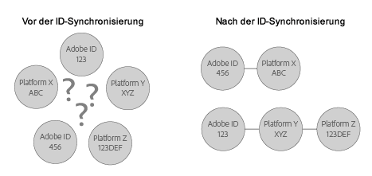

# ID-Synchronisierung und Übereinstimmungsraten{#understanding-id-synchronization-and-match-rates}

Eine Übersicht über die ID-Synchronisierungsprozesse und Übereinstimmungsraten im Experience Cloud ID-Dienst, einschließlich Adobe Media Optimizer und des ID-Diensts.

## ID-Synchronisierung und Übereinstimmungsraten {#section-f652aae7234945e89d26dd833c5215fb}

Bei der ID-Synchronisierung werden durch den ID-Dienst zugewiesene IDs mit von unseren Kunden zu Sitebesuchern zugewiesenen IDs abgeglichen. Angenommen, der ID-Dienst hat eine Besucher-ID 1234 zugewiesen. Eine andere Plattform kennt diesen Besucher anhand der ID 4321. Der ID-Dienst ordnet diese IDs während des Synchronisierungsprozesses einander zu. Die Ergebnisse führen zu neuen Datenpunkten hinsichtlich dessen, was unsere Kunden über ihre Sitebesucher wissen. Wenn der ID-Dienst für eine ID keine Übereinstimmung finden kann, erstellt er zudem eine neue und verwendet diese ID für die künftige Synchronisierung.

Mithilfe von Übereinstimmungsraten wird die Effektivität des ID-Synchronisierungsprozesses gemessen und validiert. Hohe Übereinstimmungsraten deuten darauf hin, dass ein bestimmter Dienst effektiver ist und größere Onlinezielgruppen anspricht als ein Dienst mit niedrigen Übereinstimmungsraten. Das Vergleichen von Übereinstimmungsraten ist eine Möglichkeit, unterschiedliche integrierte Anzeigentechnologieplattformen quantifizierbar zu evaluieren.



**Sicherstellen hoher Übereinstimmungsraten**

Um hohe Übereinstimmungsraten zu erzielen, müssen Sie den ID-Dienst ordnungsgemäß einrichten (siehe Anleitung [zur standardmäßigen Implementierung](../mcvid-implementation-guides/mcvid-standard.md#concept-89cd0199a9634fc48644f2d61e3d2445)). Eine ordnungsgemäße Implementierung hilft, hohe Übereinstimmungsraten sicherzustellen, da dadurch der ID-Dienst die gewünschten Cookies festlegen kann, um zu funktionieren bzw. IDs mit fähigen Datenpartnern zu synchronisieren. Faktoren wie eine langsame Internetverbindung, die Datenerfassung über Mobilgeräte oder Funknetzwerke können sich jedoch darauf auswirken, wie gut der ID-Dienst IDs erfasst, synchronisiert und abgleicht. Diese clientseitigen Variablen werden weder durch den ID-Dienst noch von [!DNL Adobe] gesteuert.

## ID-Synchronisierungsprozess beschrieben {#section-a541a85cbbc74f5682824b1a2ee2a657}

Der ID-Dienst synchronisiert IDs in Echtzeit. Dieser Prozess arbeitet im Browser und nicht über eine Server-zu-Server-Datenübertragung. In der folgenden Tabelle werden die Schritte im ID-Synchronisierungsprozess beschrieben.

**Schritt 1: Seite laden**

Wenn ein Besucher Ihre Site aufruft und eine Seite lädt, stellt die `Visitor.getInstance` Funktion einen [CORS](../mcvid-reference/mcvid-cors.md#concept-6c280446990d46d88ba9da15d2dcc758) - oder JSON-P-Aufruf an den ID-Dienst her. Der ID-Dienst antwortet mit einem Cookie, der die [!DNL Experience Cloud] ID (MID) des Besuchers enthält. Bei der MID handelt es sich um eine jedem Sitebesucher zugewiesene eindeutige ID. Siehe auch [Cookies und der Experience Cloud ID-Dienst](../mcvid-introduction/mcvid-cookies.md).

**Schritt 2: iFrame laden**

Während der Seitentext geladen wird, lädt der ID-Dienst einen iFrame namens *`Destination Publishing iFrame`*. [!DNL Destination Publishing iFrame] Die Laden in einer Domäne, die von der übergeordneten Seite getrennt wird. Dieses Design hilft beim Gewährleisten der Seitenleistung und verbessert die Sicherheit aufgrund des iFrames:

* Wird im Verhältnis zur übergeordneten Seite asynchron geladen. Das bedeutet, dass die übergeordnete Seite unabhängig von der Seite geladen [!DNL Destination Publishing iFrame]wird. Das Laden des iFrames und von ID-Synchronisierungspixeln in iFrame wirkt sich weder auf die übergeordnete Seite noch auf die Benutzeroberfläche aus.
* Wird so schnell wie möglich geladen. Wenn dies zu schnell ist, können Sie den iFrame im Anschluss an das Fensterladeereignis laden (nicht empfohlen). Siehe [idSyncAttachIframeOnWindowLoad](../mcvid-library/mcvid-function-vars/mcvid-idsyncattachiframeonwindowload.md#reference-b86b7112e0814a4c82c4e24c158508f4) für Einzelheiten.
* Verhindert, dass Code im iFrame Zugriff auf die übergeordnete Seite erlangt oder sie beeinflusst.

Siehe auch [Anfordern und Festlegen von IDs durch den Experience Cloud ID-Dienst...](../mcvid-introduction/mcvid-id-request.md#concept-2caacebb1d244402816760e9b8bcef6a).

**Schritt 3: ID-Synchronisierungen auslösen**

Die ID-Synchronisierung ist eine im Destination Publishing iFrame ausgelöste URL. Eine URL für die ID-Synchronisierung enthält, wie in diesem generischen Beispiel gezeigt, den ID-Synchronisierungsendpunkt eines Partners und eine Umleitungs-URL, die zu [!DNL Adobe] zurückleitet und die entsprechende ID enthält.

```
http://abc.com?partner_id=abc&sync_id=123&redir=http://dpm.demdex.net/ibs:dpid=<
<varname>
  ADOBE_PARTNER_ID
</varname>>&dpuuid=<
<varname>
  PARTNER_UUID
</varname>>
```

Siehe auch [ID-Synchronisierung für eingehende Datenübertragungen](https://marketing.adobe.com/resources/help/en_US/aam/c_id_sync_in.html).

**Schritt 4: IDs speichern**

Synchronisierte IDs werden auf den [Edge- und Kerndatenservern](https://marketing.adobe.com/resources/help/en_US/aam/c_compedge.html) gespeichert.

## Synchronisierungsdienste verwalten die ID-Synchronisierung {#section-cd5784d7ad404a24aa28ad4816a0119a}

Der Begriff *`Sync Services`* bezieht sich auf interne [!DNL Experience Cloud] Technologien, die für die ID-Synchronisierung verantwortlich sind. Dieser Dienst ist standardmäßig aktiviert. Um ihn zu deaktivieren, müssen Sie eine [optionale Variable](../mcvid-library/mcvid-function-vars/mcvid-disableidsync.md#reference-589d6b489ac64eddb5a7ff758945e414) zur ID-Dienstfunktion `Visitor.getInstance` hinzufügen. Synchronisierungsdienste entsprechen verschiedenen [!DNL Experience Cloud] IDs, wie zum Beispiel:

* Drittanbieter [!DNL Experience Cloud] -Cookie-IDs für Erstanbieter [!DNL Experience Cloud] -IDs.

* Erstanbieter [!DNL Experience Cloud] -Cookie-IDs für [!DNL Adobe Media Optimizer] (AMO) IDs.

* [!DNL Experience Cloud]-Cookie-IDs von Drittanbietern mit Drittdatenanbieter- und Targeting-Plattform-IDs. Dies umfasst Dienste und Plattformen wie Datenanbieter, bedarfsgesteuerte bzw. anbieterseitige Plattformen, Werbenetzwerke, Austausche usw.
* Erstanbieter [!DNL Experience Cloud] -Cookie-IDs für geräteübergreifende Partner-IDs.

## ID-Synchronisierung mit Adobe Media Optimizer {#section-642c885ea65d45ffb761f78838735016}

[!DNL Adobe Media Optimizer] bildet eine Ausnahme für den iframe-basierten ID-Synchronisierungsprozess. Because [!DNL Media Optimizer] is a trusted domain, ID syncs take place from the parent page rather than in the [!DNL Destination Publishing iFrame]. Während der Synchronisierung werden die ID-Dienstaufrufe [!DNL Media Optimizer] ausgeführt. `cm.eversttech.net`Dies ist ein Legacy-Domänenname, der von [!DNL Media Optimizer] vor der Akquise von Adobe verwendet wird. Das Senden von Daten an [!DNL Media Optimizer] kann Übereinstimmungsraten verbessern und wird für Kunden mit Version 2.0 des ID-Diensts (oder höher) automatisch durchgeführt. Siehe auch [Cookies in Media Optimizer](https://marketing.adobe.com/resources/help/en_US/whitepapers/cookies/cookies_media_optimizer.html).

>[!MORE_ LIKE_ THIS]
>
>* [Aufrufe an die Domäne „demdex.net“ ](https://marketing.adobe.com/resources/help/en_US/aam/demdex-calls.html)

